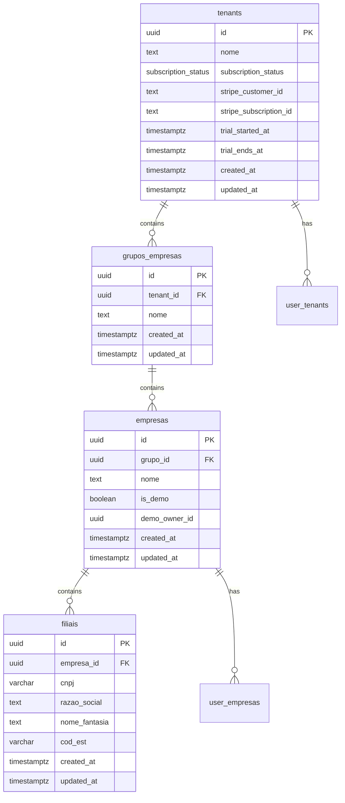
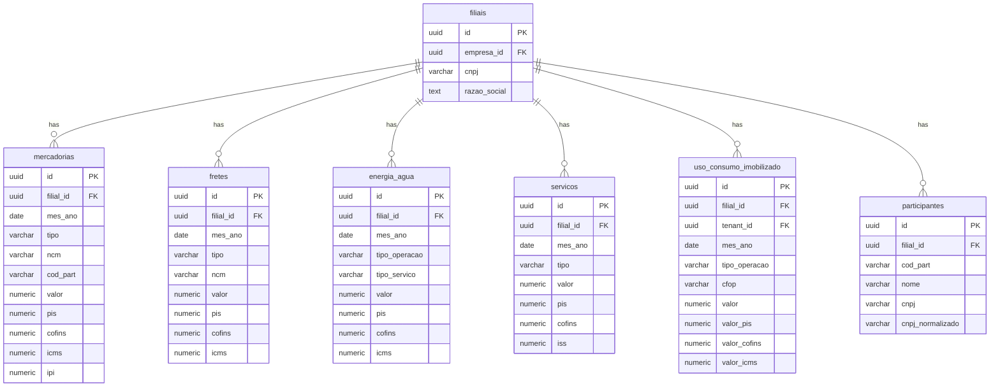
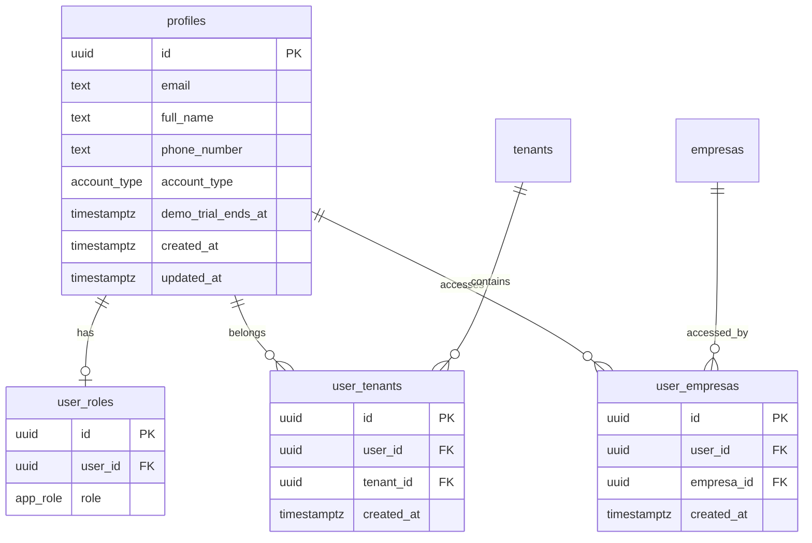
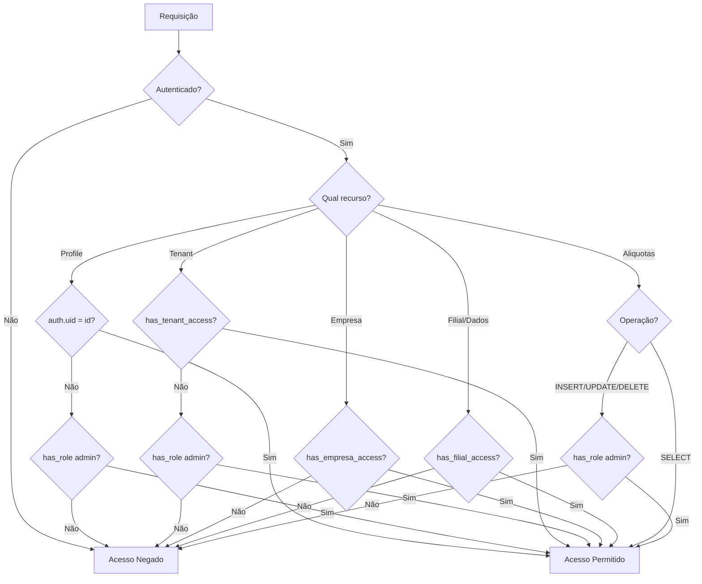
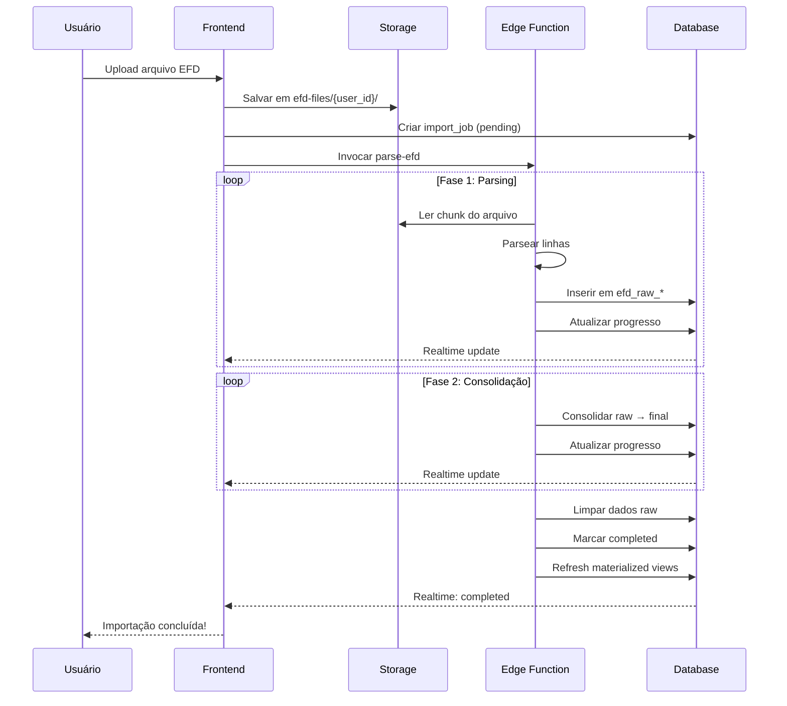

# Modelo de Dados - Sistema de Gestão Tributária

> Documentação técnica completa do modelo de dados para o sistema de gestão da Reforma Tributária brasileira.

**Versão:** 2.0  
**Última atualização:** Janeiro 2026  
**Banco de dados:** PostgreSQL (Supabase)

---

## Índice

1. [Visão Geral](#1-visão-geral)
2. [Hierarquia Organizacional](#2-hierarquia-organizacional)
3. [Gestão de Usuários](#3-gestão-de-usuários)
4. [Dados Transacionais](#4-dados-transacionais)
5. [Tabelas de Suporte](#5-tabelas-de-suporte)
6. [Tabelas de Staging (EFD Raw)](#6-tabelas-de-staging-efd-raw)
7. [Funções de Segurança](#7-funções-de-segurança)
8. [Funções de Negócio](#8-funções-de-negócio)
9. [Materialized Views](#9-materialized-views)
10. [Políticas RLS](#10-políticas-rls)
11. [Índices de Performance](#11-índices-de-performance)
12. [Triggers](#12-triggers)
13. [Storage](#13-storage)
14. [Dados Iniciais](#14-dados-iniciais)
15. [Diagramas](#15-diagramas)

---

## 1. Visão Geral

### 1.1 Propósito do Sistema

O sistema foi desenvolvido para auxiliar empresas na gestão da transição tributária brasileira, permitindo:

- **Importação de arquivos EFD** (SPED Fiscal - PIS/COFINS e ICMS)
- **Cálculo de créditos e débitos** de PIS, COFINS, ICMS, ISS e IBS/CBS
- **Simulação de cenários** da reforma tributária (2027-2033)
- **Dashboards analíticos** para tomada de decisão
- **Gestão de participantes** (fornecedores/clientes do Simples Nacional)
- **Controle de uso/consumo e imobilizado**

### 1.2 Arquitetura Multi-Tenant

O sistema utiliza arquitetura **multi-tenant** onde:

- Cada **tenant** representa um ambiente isolado (escritório contábil, empresa)
- Usuários podem pertencer a múltiplos tenants
- Dados são completamente isolados entre tenants via **Row Level Security (RLS)**
- Suporte a contas demo com limites específicos

### 1.3 Extensões Utilizadas

```sql
CREATE EXTENSION IF NOT EXISTS "uuid-ossp";   -- Geração de UUIDs
CREATE EXTENSION IF NOT EXISTS "pgcrypto";    -- Criptografia
```

---

## 2. Hierarquia Organizacional

A estrutura organizacional segue uma hierarquia de 4 níveis:

```
Tenant → Grupo de Empresas → Empresa → Filial
```

### 2.1 Tabela: `tenants`

Representa o ambiente isolado de mais alto nível (multi-tenancy).

| Coluna | Tipo | Nullable | Default | Descrição |
|--------|------|----------|---------|-----------|
| `id` | UUID | Não | `gen_random_uuid()` | Identificador único |
| `nome` | TEXT | Não | `'Meu Ambiente'` | Nome do tenant |
| `trial_started_at` | TIMESTAMPTZ | Sim | `now()` | Início do período trial |
| `trial_ends_at` | TIMESTAMPTZ | Sim | `now() + 14 days` | Fim do período trial |
| `subscription_status` | subscription_status | Sim | `'trial'` | Status da assinatura |
| `stripe_customer_id` | TEXT | Sim | - | ID do cliente no Stripe |
| `stripe_subscription_id` | TEXT | Sim | - | ID da assinatura no Stripe |
| `created_at` | TIMESTAMPTZ | Não | `now()` | Data de criação |
| `updated_at` | TIMESTAMPTZ | Não | `now()` | Data de atualização |

**Enum: `subscription_status`**
- `'trial'` - Período de teste
- `'active'` - Assinatura ativa
- `'cancelled'` - Assinatura cancelada
- `'past_due'` - Pagamento atrasado

**Características:**
- Primeiro nível da hierarquia
- Usuários são vinculados via `user_tenants`
- Apenas admins podem criar novos tenants
- Integração com Stripe para billing

---

### 2.2 Tabela: `grupos_empresas`

Agrupa empresas dentro de um tenant (ex: holdings, grupos econômicos).

| Coluna | Tipo | Nullable | Default | Descrição |
|--------|------|----------|---------|-----------|
| `id` | UUID | Não | `gen_random_uuid()` | Identificador único |
| `tenant_id` | UUID | Não | - | FK para tenant |
| `nome` | TEXT | Não | - | Nome do grupo |
| `created_at` | TIMESTAMPTZ | Não | `now()` | Data de criação |
| `updated_at` | TIMESTAMPTZ | Não | `now()` | Data de atualização |

**Relacionamentos:**
- `tenant_id` → `tenants.id` (N:1)

---

### 2.3 Tabela: `empresas`

Representa uma empresa (pessoa jurídica) dentro de um grupo.

| Coluna | Tipo | Nullable | Default | Descrição |
|--------|------|----------|---------|-----------|
| `id` | UUID | Não | `gen_random_uuid()` | Identificador único |
| `grupo_id` | UUID | Não | - | FK para grupo |
| `nome` | TEXT | Não | - | Nome da empresa |
| `is_demo` | BOOLEAN | Não | `false` | Se é empresa demo |
| `demo_owner_id` | UUID | Sim | - | ID do usuário dono da demo |
| `created_at` | TIMESTAMPTZ | Não | `now()` | Data de criação |
| `updated_at` | TIMESTAMPTZ | Não | `now()` | Data de atualização |

**Relacionamentos:**
- `grupo_id` → `grupos_empresas.id` (N:1)

---

### 2.4 Tabela: `filiais`

Representa uma filial (estabelecimento com CNPJ) de uma empresa.

| Coluna | Tipo | Nullable | Default | Descrição |
|--------|------|----------|---------|-----------|
| `id` | UUID | Não | `gen_random_uuid()` | Identificador único |
| `empresa_id` | UUID | Não | - | FK para empresa |
| `cnpj` | VARCHAR | Não | - | CNPJ (14 dígitos) |
| `razao_social` | TEXT | Não | - | Razão social |
| `nome_fantasia` | TEXT | Sim | - | Nome fantasia |
| `cod_est` | VARCHAR | Sim | - | Código do estabelecimento |
| `created_at` | TIMESTAMPTZ | Não | `now()` | Data de criação |
| `updated_at` | TIMESTAMPTZ | Não | `now()` | Data de atualização |

**Relacionamentos:**
- `empresa_id` → `empresas.id` (N:1)

**Restrições:**
- `cnpj` deve ter exatamente 14 caracteres numéricos
- CNPJ único por empresa (constraint UNIQUE em `empresa_id, cnpj`)

**Nota:** A filial é o nível operacional onde são registradas as transações fiscais.

---

## 3. Gestão de Usuários

### 3.1 Enum: `app_role`

Define os papéis disponíveis no sistema:

```sql
CREATE TYPE public.app_role AS ENUM ('admin', 'user', 'viewer');
```

| Valor | Descrição | Permissões |
|-------|-----------|------------|
| `admin` | Administrador | CRUD em todas as tabelas, gerência de usuários |
| `user` | Usuário padrão | CRUD em dados transacionais |
| `viewer` | Visualizador | Somente leitura |

### 3.2 Enum: `account_type`

Define os tipos de conta disponíveis:

```sql
CREATE TYPE public.account_type AS ENUM ('standard', 'demo');
```

| Valor | Descrição |
|-------|-----------|
| `standard` | Conta padrão |
| `demo` | Conta de demonstração |

---

### 3.3 Tabela: `profiles`

Armazena informações de perfil dos usuários (sincronizado com `auth.users`).

| Coluna | Tipo | Nullable | Default | Descrição |
|--------|------|----------|---------|-----------|
| `id` | UUID | Não | - | ID do usuário (= auth.users.id) |
| `email` | TEXT | Não | - | Email do usuário |
| `full_name` | TEXT | Sim | - | Nome completo |
| `phone_number` | TEXT | Sim | - | Número de telefone |
| `account_type` | account_type | Não | `'standard'` | Tipo da conta |
| `demo_trial_ends_at` | TIMESTAMPTZ | Sim | - | Fim do trial demo |
| `security_keyword_hash` | TEXT | Sim | - | Hash da palavra de segurança |
| `created_at` | TIMESTAMPTZ | Não | `now()` | Data de criação |
| `updated_at` | TIMESTAMPTZ | Não | `now()` | Data de atualização |

**Relacionamentos:**
- `id` → `auth.users.id` (1:1) - via trigger `handle_new_user`

**Nota:** Esta tabela é criada automaticamente quando um usuário se cadastra, através do trigger `on_auth_user_created`.

---

### 3.4 Tabela: `user_roles`

Associa usuários aos seus papéis (roles).

| Coluna | Tipo | Nullable | Default | Descrição |
|--------|------|----------|---------|-----------|
| `id` | UUID | Não | `gen_random_uuid()` | Identificador único |
| `user_id` | UUID | Não | - | ID do usuário |
| `role` | app_role | Não | `'user'` | Papel atribuído |

**Relacionamentos:**
- `user_id` → `auth.users.id` (N:1)

**Regras:**
- Primeiro usuário do sistema recebe `admin` automaticamente
- Demais usuários recebem `user` por padrão
- Um usuário pode ter apenas um role

---

### 3.5 Tabela: `user_tenants`

Vincula usuários aos tenants que podem acessar.

| Coluna | Tipo | Nullable | Default | Descrição |
|--------|------|----------|---------|-----------|
| `id` | UUID | Não | `gen_random_uuid()` | Identificador único |
| `user_id` | UUID | Não | - | ID do usuário |
| `tenant_id` | UUID | Não | - | ID do tenant |
| `created_at` | TIMESTAMPTZ | Não | `now()` | Data de criação |

**Relacionamentos:**
- `user_id` → `auth.users.id` (N:1)
- `tenant_id` → `tenants.id` (N:1)

**Restrições:**
- Constraint UNIQUE em `(user_id, tenant_id)` - evita duplicatas

---

### 3.6 Tabela: `user_empresas`

Vincula usuários a empresas específicas.

| Coluna | Tipo | Nullable | Default | Descrição |
|--------|------|----------|---------|-----------|
| `id` | UUID | Não | `gen_random_uuid()` | Identificador único |
| `user_id` | UUID | Não | - | ID do usuário |
| `empresa_id` | UUID | Não | - | ID da empresa |
| `created_at` | TIMESTAMPTZ | Não | `now()` | Data de criação |

**Relacionamentos:**
- `user_id` → `auth.users.id` (N:1)
- `empresa_id` → `empresas.id` (N:1)

---

### 3.7 Tabela: `password_reset_tokens`

Armazena tokens para reset de senha.

| Coluna | Tipo | Nullable | Default | Descrição |
|--------|------|----------|---------|-----------|
| `id` | UUID | Não | `gen_random_uuid()` | Identificador único |
| `user_id` | UUID | Não | - | ID do usuário |
| `token` | TEXT | Não | - | Token de reset |
| `expires_at` | TIMESTAMPTZ | Não | - | Data de expiração |
| `used` | BOOLEAN | Sim | `false` | Se já foi utilizado |
| `created_at` | TIMESTAMPTZ | Não | `now()` | Data de criação |

**Restrições:**
- Tokens não podem ser deletados (apenas marcados como used)

---

## 4. Dados Transacionais

As tabelas transacionais armazenam os dados fiscais importados dos arquivos EFD.

### 4.1 Tabela: `mercadorias`

Registra operações de entrada e saída de mercadorias.

| Coluna | Tipo | Nullable | Default | Descrição |
|--------|------|----------|---------|-----------|
| `id` | UUID | Não | `gen_random_uuid()` | Identificador único |
| `filial_id` | UUID | Não | - | FK para filial |
| `mes_ano` | DATE | Não | - | Mês/ano de referência (dia=1) |
| `tipo` | VARCHAR | Não | - | `'entrada'` ou `'saida'` |
| `ncm` | VARCHAR | Sim | - | Código NCM (8 dígitos) |
| `cod_part` | VARCHAR | Sim | - | Código do participante |
| `descricao` | TEXT | Sim | - | Descrição do item |
| `valor` | NUMERIC | Não | `0` | Valor total da operação |
| `pis` | NUMERIC | Não | `0` | Valor de PIS |
| `cofins` | NUMERIC | Não | `0` | Valor de COFINS |
| `icms` | NUMERIC | Sim | `0` | Valor de ICMS |
| `ipi` | NUMERIC | Sim | `0` | Valor de IPI |
| `created_at` | TIMESTAMPTZ | Não | `now()` | Data de criação |
| `updated_at` | TIMESTAMPTZ | Não | `now()` | Data de atualização |

**Relacionamentos:**
- `filial_id` → `filiais.id` (N:1)
- `cod_part` → link lógico com `participantes.cod_part`

**Validações:**
- `tipo` deve ser `'entrada'` ou `'saida'`
- Valores fiscais devem ser >= 0

---

### 4.2 Tabela: `fretes`

Registra operações de frete (créditos e débitos).

| Coluna | Tipo | Nullable | Default | Descrição |
|--------|------|----------|---------|-----------|
| `id` | UUID | Não | `gen_random_uuid()` | Identificador único |
| `filial_id` | UUID | Não | - | FK para filial |
| `mes_ano` | DATE | Não | - | Mês/ano de referência |
| `tipo` | VARCHAR | Não | - | `'credito'` ou `'debito'` |
| `ncm` | VARCHAR | Sim | - | Código NCM |
| `descricao` | TEXT | Sim | - | Descrição |
| `cnpj_transportadora` | VARCHAR | Sim | - | CNPJ da transportadora |
| `valor` | NUMERIC | Não | `0` | Valor do frete |
| `pis` | NUMERIC | Não | `0` | Valor de PIS |
| `cofins` | NUMERIC | Não | `0` | Valor de COFINS |
| `icms` | NUMERIC | Não | `0` | Valor de ICMS |
| `created_at` | TIMESTAMPTZ | Não | `now()` | Data de criação |
| `updated_at` | TIMESTAMPTZ | Não | `now()` | Data de atualização |

**Relacionamentos:**
- `filial_id` → `filiais.id` (N:1)

**Validações:**
- `tipo` deve ser `'credito'` ou `'debito'`

---

### 4.3 Tabela: `energia_agua`

Registra despesas/créditos com utilidades e comunicação.

| Coluna | Tipo | Nullable | Default | Descrição |
|--------|------|----------|---------|-----------|
| `id` | UUID | Não | `gen_random_uuid()` | Identificador único |
| `filial_id` | UUID | Não | - | FK para filial |
| `mes_ano` | DATE | Não | - | Mês/ano de referência |
| `tipo_operacao` | VARCHAR | Não | - | `'credito'` ou `'debito'` |
| `tipo_servico` | VARCHAR | Não | - | Tipo do serviço |
| `descricao` | TEXT | Sim | - | Descrição |
| `cnpj_fornecedor` | VARCHAR | Sim | - | CNPJ do fornecedor |
| `valor` | NUMERIC | Não | `0` | Valor |
| `pis` | NUMERIC | Não | `0` | Valor de PIS |
| `cofins` | NUMERIC | Não | `0` | Valor de COFINS |
| `icms` | NUMERIC | Não | `0` | Valor de ICMS |
| `created_at` | TIMESTAMPTZ | Não | `now()` | Data de criação |
| `updated_at` | TIMESTAMPTZ | Não | `now()` | Data de atualização |

**Valores de `tipo_servico`:**
- `'energia'` - Energia elétrica
- `'agua'` - Água e saneamento
- `'gas'` - Gás natural/GLP
- `'comunicacao'` - Telecomunicações

**Relacionamentos:**
- `filial_id` → `filiais.id` (N:1)

---

### 4.4 Tabela: `servicos`

Registra operações de serviços (bloco A do EFD).

| Coluna | Tipo | Nullable | Default | Descrição |
|--------|------|----------|---------|-----------|
| `id` | UUID | Não | `gen_random_uuid()` | Identificador único |
| `filial_id` | UUID | Não | - | FK para filial |
| `mes_ano` | DATE | Não | - | Mês/ano de referência |
| `tipo` | VARCHAR | Não | - | `'entrada'` ou `'saida'` |
| `ncm` | VARCHAR | Sim | - | Código NCM/NBS |
| `descricao` | TEXT | Sim | - | Descrição do serviço |
| `valor` | NUMERIC | Não | `0` | Valor do serviço |
| `pis` | NUMERIC | Não | `0` | Valor de PIS |
| `cofins` | NUMERIC | Não | `0` | Valor de COFINS |
| `iss` | NUMERIC | Não | `0` | Valor de ISS |
| `created_at` | TIMESTAMPTZ | Não | `now()` | Data de criação |
| `updated_at` | TIMESTAMPTZ | Não | `now()` | Data de atualização |

**Relacionamentos:**
- `filial_id` → `filiais.id` (N:1)

---

### 4.5 Tabela: `uso_consumo_imobilizado`

Registra materiais de uso/consumo e bens do ativo imobilizado.

| Coluna | Tipo | Nullable | Default | Descrição |
|--------|------|----------|---------|-----------|
| `id` | UUID | Não | `gen_random_uuid()` | Identificador único |
| `tenant_id` | UUID | Não | - | FK para tenant |
| `filial_id` | UUID | Não | - | FK para filial |
| `mes_ano` | DATE | Não | - | Mês/ano de referência |
| `tipo_operacao` | VARCHAR | Não | - | Tipo de operação |
| `cfop` | VARCHAR | Não | - | CFOP da operação |
| `cod_part` | VARCHAR | Sim | - | Código do participante |
| `num_doc` | VARCHAR | Sim | - | Número do documento |
| `valor` | NUMERIC | Não | `0` | Valor total |
| `valor_pis` | NUMERIC | Não | `0` | Valor de PIS |
| `valor_cofins` | NUMERIC | Não | `0` | Valor de COFINS |
| `valor_icms` | NUMERIC | Não | `0` | Valor de ICMS |
| `created_at` | TIMESTAMPTZ | Não | `now()` | Data de criação |

**Valores de `tipo_operacao`:**
- `'uso_consumo'` - Material de uso e consumo
- `'imobilizado'` - Ativo imobilizado

**Relacionamentos:**
- `tenant_id` → `tenants.id` (N:1)
- `filial_id` → `filiais.id` (N:1)

---

### 4.6 Tabela: `participantes`

Armazena informações dos participantes (fornecedores/clientes).

| Coluna | Tipo | Nullable | Default | Descrição |
|--------|------|----------|---------|-----------|
| `id` | UUID | Não | `gen_random_uuid()` | Identificador único |
| `filial_id` | UUID | Não | - | FK para filial |
| `cod_part` | VARCHAR | Não | - | Código do participante |
| `nome` | VARCHAR | Não | - | Nome/Razão social |
| `cnpj` | VARCHAR | Sim | - | CNPJ (formatado) |
| `cnpj_normalizado` | VARCHAR | Sim | - | CNPJ (apenas números) |
| `cpf` | VARCHAR | Sim | - | CPF |
| `ie` | VARCHAR | Sim | - | Inscrição Estadual |
| `cod_mun` | VARCHAR | Sim | - | Código do município |
| `created_at` | TIMESTAMPTZ | Não | `now()` | Data de criação |
| `updated_at` | TIMESTAMPTZ | Não | `now()` | Data de atualização |

**Relacionamentos:**
- `filial_id` → `filiais.id` (N:1)

**Nota:** O campo `cnpj_normalizado` é preenchido automaticamente via trigger.

---

### 4.7 Tabela: `simples_nacional`

Indica se um CNPJ é optante do Simples Nacional.

| Coluna | Tipo | Nullable | Default | Descrição |
|--------|------|----------|---------|-----------|
| `id` | UUID | Não | `gen_random_uuid()` | Identificador único |
| `tenant_id` | UUID | Não | - | FK para tenant |
| `cnpj` | VARCHAR | Não | - | CNPJ (normalizado) |
| `is_simples` | BOOLEAN | Não | `false` | Se é Simples Nacional |
| `created_at` | TIMESTAMPTZ | Não | `now()` | Data de criação |
| `updated_at` | TIMESTAMPTZ | Não | `now()` | Data de atualização |

**Relacionamentos:**
- `tenant_id` → `tenants.id` (N:1)

**Uso:** Vinculado a `participantes` via CNPJ para determinar direito a crédito.

---

## 5. Tabelas de Suporte

### 5.1 Tabela: `aliquotas`

Armazena as alíquotas da reforma tributária por ano.

| Coluna | Tipo | Nullable | Default | Descrição |
|--------|------|----------|---------|-----------|
| `id` | UUID | Não | `gen_random_uuid()` | Identificador único |
| `ano` | INTEGER | Não | - | Ano de vigência |
| `ibs_estadual` | NUMERIC | Não | `0` | Alíquota IBS estadual (%) |
| `ibs_municipal` | NUMERIC | Não | `0` | Alíquota IBS municipal (%) |
| `cbs` | NUMERIC | Não | `0` | Alíquota CBS federal (%) |
| `reduc_icms` | NUMERIC | Não | `0` | Redutor ICMS (%) |
| `reduc_piscofins` | NUMERIC | Não | `0` | Redutor PIS/COFINS (%) |
| `is_active` | BOOLEAN | Sim | `true` | Se está ativo |
| `created_at` | TIMESTAMPTZ | Não | `now()` | Data de criação |
| `updated_at` | TIMESTAMPTZ | Não | `now()` | Data de atualização |

**Restrições:**
- Constraint UNIQUE em `ano`
- Alíquotas devem estar entre 0 e 100

---

### 5.2 Tabela: `import_jobs`

Controla o status e progresso das importações de arquivos EFD.

| Coluna | Tipo | Nullable | Default | Descrição |
|--------|------|----------|---------|-----------|
| `id` | UUID | Não | `gen_random_uuid()` | Identificador único |
| `user_id` | UUID | Não | - | Usuário que iniciou |
| `empresa_id` | UUID | Não | - | Empresa de destino |
| `filial_id` | UUID | Sim | - | Filial (extraída do EFD) |
| `file_path` | TEXT | Não | - | Caminho no storage |
| `file_name` | TEXT | Não | - | Nome do arquivo |
| `file_size` | BIGINT | Não | `0` | Tamanho em bytes |
| `status` | TEXT | Não | `'pending'` | Status atual |
| `current_phase` | TEXT | Sim | `'pending'` | Fase atual do processamento |
| `progress` | INTEGER | Não | `0` | Progresso (0-100) |
| `total_lines` | INTEGER | Não | `0` | Total de linhas |
| `parsing_total_lines` | INTEGER | Sim | `0` | Total de linhas para parsing |
| `parsing_offset` | INTEGER | Sim | `0` | Offset de parsing |
| `bytes_processed` | BIGINT | Sim | `0` | Bytes processados |
| `chunk_number` | INTEGER | Sim | `0` | Chunk atual |
| `import_scope` | TEXT | Não | `'all'` | Escopo da importação |
| `record_limit` | INTEGER | Sim | `0` | Limite de registros |
| `mes_ano` | DATE | Sim | - | Mês/ano do arquivo |
| `counts` | JSONB | Não | `{...}` | Contadores |
| `temp_block0_lines` | TEXT[] | Sim | `'{}'` | Linhas temporárias bloco 0 |
| `temp_blocka_lines` | TEXT[] | Sim | `'{}'` | Linhas temporárias bloco A |
| `temp_blockc_lines` | TEXT[] | Sim | `'{}'` | Linhas temporárias bloco C |
| `temp_blockd_lines` | TEXT[] | Sim | `'{}'` | Linhas temporárias bloco D |
| `error_message` | TEXT | Sim | - | Mensagem de erro |
| `started_at` | TIMESTAMPTZ | Sim | - | Início do processamento |
| `completed_at` | TIMESTAMPTZ | Sim | - | Fim do processamento |
| `created_at` | TIMESTAMPTZ | Não | `now()` | Data de criação |
| `updated_at` | TIMESTAMPTZ | Não | `now()` | Data de atualização |

**Valores de `status`:**
- `'pending'` - Aguardando processamento
- `'processing'` - Em processamento
- `'completed'` - Concluído com sucesso
- `'error'` - Erro no processamento
- `'cancelled'` - Cancelado pelo usuário

**Estrutura de `counts`:**
```json
{
  "mercadorias": 0,
  "fretes": 0,
  "energia_agua": 0,
  "servicos": 0
}
```

**Nota:** Esta tabela tem **Realtime** habilitado para atualização de progresso em tempo real.

---

### 5.3 Tabela: `audit_logs`

Registra ações de auditoria no sistema.

| Coluna | Tipo | Nullable | Default | Descrição |
|--------|------|----------|---------|-----------|
| `id` | UUID | Não | `gen_random_uuid()` | Identificador único |
| `user_id` | UUID | Não | - | Usuário que executou |
| `tenant_id` | UUID | Não | - | Tenant afetado |
| `action` | TEXT | Não | - | Ação executada |
| `table_name` | TEXT | Sim | - | Tabela afetada |
| `record_count` | INTEGER | Sim | - | Quantidade de registros |
| `details` | JSONB | Sim | - | Detalhes adicionais |
| `created_at` | TIMESTAMPTZ | Sim | `now()` | Data da ação |

**Valores comuns de `action`:**
- `'import_efd'` - Importação de arquivo EFD
- `'delete_batch'` - Exclusão em lote
- `'clear_data'` - Limpeza de dados
- `'reset_all'` - Reset completo

**Restrições:**
- Registros não podem ser atualizados ou deletados (imutável)

---

### 5.4 Tabela: `subscription_plans`

Armazena os planos de assinatura disponíveis.

| Coluna | Tipo | Nullable | Default | Descrição |
|--------|------|----------|---------|-----------|
| `id` | UUID | Não | `gen_random_uuid()` | Identificador único |
| `name` | TEXT | Não | - | Nome do plano |
| `price_monthly` | NUMERIC | Não | `0` | Preço mensal |
| `features` | JSONB | Não | `'[]'` | Lista de funcionalidades |
| `stripe_price_id` | TEXT | Sim | - | ID do preço no Stripe |
| `is_active` | BOOLEAN | Não | `true` | Se está ativo |
| `created_at` | TIMESTAMPTZ | Não | `now()` | Data de criação |
| `updated_at` | TIMESTAMPTZ | Não | `now()` | Data de atualização |

---

## 6. Tabelas de Staging (EFD Raw)

Tabelas temporárias para armazenar dados brutos durante o processamento do EFD.

### 6.1 Tabela: `efd_raw_lines`

Armazena linhas brutas do arquivo EFD para processamento.

| Coluna | Tipo | Nullable | Default | Descrição |
|--------|------|----------|---------|-----------|
| `id` | BIGINT | Não | `nextval(...)` | Identificador único |
| `job_id` | UUID | Não | - | FK para import_jobs |
| `line_number` | INTEGER | Não | - | Número da linha |
| `block_type` | TEXT | Não | - | Tipo do bloco (0, A, C, D, etc) |
| `content` | TEXT | Não | - | Conteúdo da linha |
| `created_at` | TIMESTAMPTZ | Não | `now()` | Data de criação |

---

### 6.2 Tabela: `efd_raw_a100`

Dados brutos do bloco A (serviços).

| Coluna | Tipo | Nullable | Default | Descrição |
|--------|------|----------|---------|-----------|
| `id` | UUID | Não | `gen_random_uuid()` | Identificador único |
| `import_job_id` | UUID | Não | - | FK para import_jobs |
| `filial_id` | UUID | Não | - | FK para filial |
| `mes_ano` | DATE | Não | - | Mês/ano |
| `tipo` | VARCHAR | Não | - | Tipo (entrada/saída) |
| `valor` | NUMERIC | Não | `0` | Valor |
| `pis` | NUMERIC | Não | `0` | Valor PIS |
| `cofins` | NUMERIC | Não | `0` | Valor COFINS |
| `iss` | NUMERIC | Sim | `0` | Valor ISS |
| `created_at` | TIMESTAMPTZ | Sim | `now()` | Data de criação |

---

### 6.3 Tabela: `efd_raw_c100`

Dados brutos do bloco C (mercadorias).

| Coluna | Tipo | Nullable | Default | Descrição |
|--------|------|----------|---------|-----------|
| `id` | UUID | Não | `gen_random_uuid()` | Identificador único |
| `import_job_id` | UUID | Não | - | FK para import_jobs |
| `filial_id` | UUID | Não | - | FK para filial |
| `mes_ano` | DATE | Não | - | Mês/ano |
| `tipo` | VARCHAR | Não | - | Tipo (entrada/saída) |
| `cod_part` | VARCHAR | Sim | - | Código do participante |
| `valor` | NUMERIC | Não | `0` | Valor |
| `pis` | NUMERIC | Não | `0` | Valor PIS |
| `cofins` | NUMERIC | Não | `0` | Valor COFINS |
| `icms` | NUMERIC | Sim | `0` | Valor ICMS |
| `ipi` | NUMERIC | Sim | `0` | Valor IPI |
| `created_at` | TIMESTAMPTZ | Sim | `now()` | Data de criação |

---

### 6.4 Tabela: `efd_raw_c500`

Dados brutos do bloco C500 (energia).

| Coluna | Tipo | Nullable | Default | Descrição |
|--------|------|----------|---------|-----------|
| `id` | UUID | Não | `gen_random_uuid()` | Identificador único |
| `import_job_id` | UUID | Não | - | FK para import_jobs |
| `filial_id` | UUID | Não | - | FK para filial |
| `mes_ano` | DATE | Não | - | Mês/ano |
| `tipo_operacao` | VARCHAR | Não | - | Tipo de operação |
| `tipo_servico` | VARCHAR | Não | - | Tipo de serviço |
| `cnpj_fornecedor` | VARCHAR | Sim | - | CNPJ do fornecedor |
| `valor` | NUMERIC | Não | `0` | Valor |
| `pis` | NUMERIC | Não | `0` | Valor PIS |
| `cofins` | NUMERIC | Não | `0` | Valor COFINS |
| `icms` | NUMERIC | Sim | `0` | Valor ICMS |
| `created_at` | TIMESTAMPTZ | Sim | `now()` | Data de criação |

---

### 6.5 Tabela: `efd_raw_fretes`

Dados brutos de fretes.

| Coluna | Tipo | Nullable | Default | Descrição |
|--------|------|----------|---------|-----------|
| `id` | UUID | Não | `gen_random_uuid()` | Identificador único |
| `import_job_id` | UUID | Não | - | FK para import_jobs |
| `filial_id` | UUID | Não | - | FK para filial |
| `mes_ano` | DATE | Não | - | Mês/ano |
| `tipo` | VARCHAR | Não | - | Tipo (crédito/débito) |
| `cnpj_transportadora` | VARCHAR | Sim | - | CNPJ da transportadora |
| `valor` | NUMERIC | Não | `0` | Valor |
| `pis` | NUMERIC | Não | `0` | Valor PIS |
| `cofins` | NUMERIC | Não | `0` | Valor COFINS |
| `icms` | NUMERIC | Sim | `0` | Valor ICMS |
| `created_at` | TIMESTAMPTZ | Sim | `now()` | Data de criação |

---

## 7. Funções de Segurança

Funções `SECURITY DEFINER` que implementam a lógica de controle de acesso.

### 7.1 `has_role()`

Verifica se um usuário possui determinado papel.

```sql
has_role(_user_id UUID, _role app_role) → BOOLEAN
```

**Uso:**
```sql
SELECT has_role(auth.uid(), 'admin');  -- true/false
```

---

### 7.2 `has_tenant_access()`

Verifica se um usuário tem acesso a um tenant.

```sql
has_tenant_access(_user_id UUID, _tenant_id UUID) → BOOLEAN
```

**Lógica:** Verifica se existe registro em `user_tenants` para o par (user_id, tenant_id).

---

### 7.3 `has_filial_access()`

Verifica se um usuário tem acesso a uma filial (através da hierarquia).

```sql
has_filial_access(_user_id UUID, _filial_id UUID) → BOOLEAN
```

**Lógica:** Navega a hierarquia `filial → empresa → grupo → tenant → user_tenants`.

---

### 7.4 `has_empresa_access()`

Verifica se um usuário tem acesso a uma empresa.

```sql
has_empresa_access(_user_id UUID, _empresa_id UUID) → BOOLEAN
```

**Lógica:** Navega a hierarquia `empresa → grupo → tenant → user_tenants`.

---

## 8. Funções de Negócio

### 8.1 `update_updated_at_column()`

Função de trigger para atualizar automaticamente `updated_at`.

```sql
update_updated_at_column() → TRIGGER
```

**Uso:** Aplicada em todas as tabelas com coluna `updated_at`.

---

### 8.2 Funções de Consolidação

Funções que consolidam dados brutos das tabelas `efd_raw_*` para as tabelas finais.

| Função | Descrição |
|--------|-----------|
| `consolidar_mercadorias(_job_id UUID)` | Consolida mercadorias de `efd_raw_c100` |
| `consolidar_mercadorias_batch(...)` | Versão em lotes |
| `consolidar_mercadorias_single_batch(...)` | Lote único |
| `consolidar_fretes(_job_id UUID)` | Consolida fretes de `efd_raw_fretes` |
| `consolidar_energia_agua(_job_id UUID)` | Consolida energia de `efd_raw_c500` |
| `consolidar_servicos(_job_id UUID)` | Consolida serviços de `efd_raw_a100` |
| `consolidar_import_job(_job_id UUID)` | Consolida todos os dados de um job |
| `consolidar_raw_a100_batch(...)` | Consolida bloco A em batch |
| `consolidar_raw_c100_batch(...)` | Consolida bloco C em batch |
| `consolidar_raw_c500_batch(...)` | Consolida bloco C500 em batch |
| `consolidar_raw_fretes_batch(...)` | Consolida fretes em batch |

---

### 8.3 Funções de Delete Batch

Funções para exclusão em lote com controle de acesso.

| Função | Descrição |
|--------|-----------|
| `delete_mercadorias_batch(_user_id, _filial_ids, _batch_size)` | Exclui mercadorias |
| `delete_fretes_batch(_user_id, _filial_ids, _batch_size)` | Exclui fretes |
| `delete_energia_agua_batch(_user_id, _filial_ids, _batch_size)` | Exclui energia/água |
| `delete_servicos_batch(_user_id, _filial_ids, _batch_size)` | Exclui serviços |
| `delete_participantes_batch(_user_id, _filial_ids, _batch_size)` | Exclui participantes |
| `delete_uso_consumo_batch(_user_id, _filial_ids, _batch_size)` | Exclui uso/consumo |
| `delete_efd_raw_lines_batch(_job_id, _batch_size)` | Exclui linhas raw |

---

### 8.4 Funções de Acesso a Materialized Views

Funções que retornam dados das MVs aplicando RLS.

| Função | Descrição |
|--------|-----------|
| `get_mv_mercadorias_aggregated()` | Retorna mercadorias agregadas |
| `get_mv_fretes_aggregated()` | Retorna fretes agregados |
| `get_mv_fretes_detailed()` | Retorna fretes detalhados |
| `get_mv_energia_agua_aggregated()` | Retorna energia/água agregados |
| `get_mv_energia_agua_detailed()` | Retorna energia/água detalhados |
| `get_mv_servicos_aggregated()` | Retorna serviços agregados |
| `get_mv_uso_consumo_aggregated()` | Retorna uso/consumo agregado |
| `get_mv_uso_consumo_detailed()` | Retorna uso/consumo detalhado |
| `get_mv_uso_consumo_by_simples(...)` | Uso/consumo por Simples Nacional |
| `get_mv_dashboard_stats(_mes_ano)` | Estatísticas do dashboard |

---

### 8.5 Funções de Paginação para Participantes

| Função | Descrição |
|--------|-----------|
| `get_mercadorias_participante_page(...)` | Página de mercadorias por participante |
| `get_mercadorias_participante_lista(...)` | Lista de participantes |
| `get_mercadorias_participante_meses(...)` | Meses disponíveis |
| `get_mercadorias_participante_totals(...)` | Totais por participante |

---

### 8.6 Funções de Simples Nacional

| Função | Descrição |
|--------|-----------|
| `get_simples_counts(_tenant_id)` | Contagem de registros Simples |
| `get_simples_link_stats(_tenant_id)` | Estatísticas de vinculação |
| `get_cnpjs_mercadorias_pendentes(...)` | CNPJs pendentes de classificação |
| `get_cnpjs_uso_consumo_pendentes(...)` | CNPJs uso/consumo pendentes |

---

### 8.7 Funções Auxiliares

| Função | Descrição |
|--------|-----------|
| `handle_new_user()` | Trigger para criação de perfil/role |
| `get_demo_status(_user_id)` | Status da conta demo |
| `check_demo_import_limits(...)` | Verifica limites de import demo |
| `get_tenant_subscription_info(_tenant_id)` | Info de assinatura do tenant |
| `set_trial_end_date()` | Define data fim do trial |
| `normalize_participante_cnpj()` | Normaliza CNPJ do participante |
| `cleanup_orphaned_raw_data()` | Limpa dados órfãos |
| `exec_sql(_sql)` | Executa SQL dinâmico |

---

### 8.8 Funções de Refresh de Views

| Função | Descrição |
|--------|-----------|
| `refresh_materialized_views()` | Atualiza todas as MVs |
| `refresh_all_materialized_views()` | Alias para refresh_materialized_views |
| `refresh_materialized_views_async()` | Refresh assíncrono |

---

## 9. Materialized Views

Views materializadas para performance em consultas analíticas. Todas residem no schema `extensions`.

### 9.1 Listagem de Materialized Views

| View | Descrição |
|------|-----------|
| `mv_mercadorias_aggregated` | Mercadorias agregadas por filial/mês/tipo |
| `mv_mercadorias_participante` | Mercadorias por participante |
| `mv_fretes_aggregated` | Fretes agregados por filial/mês/tipo |
| `mv_fretes_detailed` | Fretes com detalhes |
| `mv_energia_agua_aggregated` | Energia/água agregados |
| `mv_energia_agua_detailed` | Energia/água detalhados |
| `mv_servicos_aggregated` | Serviços agregados |
| `mv_uso_consumo_aggregated` | Uso/consumo agregado |
| `mv_uso_consumo_detailed` | Uso/consumo detalhado |
| `mv_participantes_cache` | Cache de participantes |
| `mv_dashboard_stats` | Estatísticas do dashboard |

---

### 9.2 `mv_mercadorias_aggregated`

| Coluna | Tipo | Descrição |
|--------|------|-----------|
| `filial_id` | UUID | ID da filial |
| `filial_nome` | TEXT | Nome da filial |
| `mes_ano` | DATE | Mês/ano |
| `tipo` | TEXT | entrada/saída |
| `valor` | NUMERIC | Soma dos valores |
| `pis` | NUMERIC | Soma de PIS |
| `cofins` | NUMERIC | Soma de COFINS |
| `icms` | NUMERIC | Soma de ICMS |

**Função de acesso:** `get_mv_mercadorias_aggregated()`

---

### 9.3 `mv_dashboard_stats`

| Coluna | Tipo | Descrição |
|--------|------|-----------|
| `filial_id` | UUID | ID da filial |
| `categoria` | TEXT | mercadorias/fretes/energia_agua/servicos |
| `subtipo` | TEXT | Tipo específico |
| `mes_ano` | DATE | Mês/ano |
| `valor` | NUMERIC | Soma dos valores |
| `icms` | NUMERIC | Soma de ICMS |
| `pis` | NUMERIC | Soma de PIS |
| `cofins` | NUMERIC | Soma de COFINS |

**Função de acesso:** `get_mv_dashboard_stats(_mes_ano DATE DEFAULT NULL)`

---

## 10. Políticas RLS

Row Level Security está habilitado em todas as tabelas para isolamento de dados.

### 10.1 Matriz de Políticas

| Tabela | SELECT | INSERT | UPDATE | DELETE |
|--------|--------|--------|--------|--------|
| `profiles` | Próprio/Admin | Próprio | Próprio | ❌ |
| `user_roles` | Próprio | Admin | Admin | Admin |
| `user_tenants` | Próprio | Próprio/Admin | Admin | Admin |
| `user_empresas` | Próprio | Próprio/Admin | Admin | Admin |
| `tenants` | Vinculado | Admin | Vinculado | Admin |
| `grupos_empresas` | Tenant | Admin+Tenant | Tenant | Tenant |
| `empresas` | Grupo | Admin+Grupo | Grupo | Grupo |
| `filiais` | Acesso | Admin+Empresa | Acesso | Acesso |
| `mercadorias` | Filial | Filial | Filial | Filial |
| `fretes` | Filial | Filial | Filial | Filial |
| `energia_agua` | Filial | Filial | Filial | Filial |
| `servicos` | Filial | Filial | Filial | Filial |
| `uso_consumo_imobilizado` | Filial | Filial | Filial | Filial |
| `participantes` | Filial | Filial | Filial | Filial |
| `simples_nacional` | Tenant | Admin+Tenant | Admin+Tenant | Admin+Tenant |
| `aliquotas` | Todos | Admin | Admin | Admin |
| `import_jobs` | Próprio | Próprio | Próprio | Próprio |
| `audit_logs` | Tenant | Próprio | ❌ | ❌ |
| `password_reset_tokens` | Próprio | Próprio | Próprio | ❌ |
| `subscription_plans` | Todos (ativos) | Admin | Admin | Admin |
| `efd_raw_*` | Job owner | Job owner | ❌ | Job owner |

### 10.2 Legenda

| Termo | Significado |
|-------|-------------|
| Próprio | `auth.uid() = user_id` |
| Admin | `has_role(auth.uid(), 'admin')` |
| Vinculado | Existe em `user_tenants` |
| Tenant | `has_tenant_access()` |
| Grupo | Acesso via tenant do grupo |
| Acesso | `has_filial_access()` |
| Filial | `has_filial_access()` |
| Todos | `true` (autenticados) |
| Job owner | Dono do import_job |

---

## 11. Índices de Performance

### 11.1 Tabelas Transacionais

```sql
-- Mercadorias
CREATE INDEX idx_mercadorias_filial_mes ON mercadorias(filial_id, mes_ano);
CREATE INDEX idx_mercadorias_tipo ON mercadorias(tipo);
CREATE INDEX idx_mercadorias_ncm ON mercadorias(ncm) WHERE ncm IS NOT NULL;
CREATE INDEX idx_mercadorias_cod_part ON mercadorias(cod_part) WHERE cod_part IS NOT NULL;

-- Fretes
CREATE INDEX idx_fretes_filial_mes ON fretes(filial_id, mes_ano);
CREATE INDEX idx_fretes_tipo ON fretes(tipo);

-- Energia/Água
CREATE INDEX idx_energia_agua_filial_mes ON energia_agua(filial_id, mes_ano);
CREATE INDEX idx_energia_agua_tipo ON energia_agua(tipo_operacao, tipo_servico);

-- Serviços
CREATE INDEX idx_servicos_filial_mes ON servicos(filial_id, mes_ano);
CREATE INDEX idx_servicos_tipo ON servicos(tipo);

-- Uso/Consumo
CREATE INDEX idx_uso_consumo_filial_mes ON uso_consumo_imobilizado(filial_id, mes_ano);
CREATE INDEX idx_uso_consumo_tipo ON uso_consumo_imobilizado(tipo_operacao);

-- Participantes
CREATE INDEX idx_participantes_filial ON participantes(filial_id);
CREATE INDEX idx_participantes_cod_part ON participantes(cod_part);
CREATE INDEX idx_participantes_cnpj_normalizado ON participantes(cnpj_normalizado);
```

### 11.2 Hierarquia Organizacional

```sql
CREATE INDEX idx_grupos_tenant ON grupos_empresas(tenant_id);
CREATE INDEX idx_empresas_grupo ON empresas(grupo_id);
CREATE INDEX idx_filiais_empresa ON filiais(empresa_id);
CREATE INDEX idx_filiais_cnpj ON filiais(cnpj);
```

### 11.3 Usuários

```sql
CREATE INDEX idx_user_tenants_user ON user_tenants(user_id);
CREATE INDEX idx_user_tenants_tenant ON user_tenants(tenant_id);
CREATE INDEX idx_user_roles_user ON user_roles(user_id);
CREATE INDEX idx_profiles_email ON profiles(email);
CREATE INDEX idx_user_empresas_user ON user_empresas(user_id);
CREATE INDEX idx_user_empresas_empresa ON user_empresas(empresa_id);
```

### 11.4 Suporte

```sql
CREATE INDEX idx_import_jobs_user ON import_jobs(user_id);
CREATE INDEX idx_import_jobs_status ON import_jobs(status);
CREATE INDEX idx_import_jobs_empresa ON import_jobs(empresa_id);
CREATE INDEX idx_audit_logs_user ON audit_logs(user_id);
CREATE INDEX idx_audit_logs_tenant ON audit_logs(tenant_id);
CREATE INDEX idx_audit_logs_action ON audit_logs(action);
CREATE INDEX idx_simples_nacional_cnpj ON simples_nacional(cnpj);
CREATE INDEX idx_simples_nacional_tenant ON simples_nacional(tenant_id);
```

---

## 12. Triggers

### 12.1 `on_auth_user_created`

Cria perfil e role automaticamente quando usuário se cadastra.

```sql
CREATE TRIGGER on_auth_user_created
  AFTER INSERT ON auth.users
  FOR EACH ROW
  EXECUTE FUNCTION handle_new_user();
```

**Nota:** Este trigger deve ser criado manualmente no Supabase Dashboard pois está no schema `auth`.

---

### 12.2 `set_trial_end_date_trigger`

Define a data de fim do trial ao criar um tenant.

```sql
CREATE TRIGGER set_trial_end_date_trigger
  BEFORE INSERT ON tenants
  FOR EACH ROW
  EXECUTE FUNCTION set_trial_end_date();
```

---

### 12.3 `tr_normalize_cnpj`

Normaliza CNPJ ao inserir/atualizar participante.

```sql
CREATE TRIGGER tr_normalize_cnpj
  BEFORE INSERT OR UPDATE ON participantes
  FOR EACH ROW
  EXECUTE FUNCTION normalize_participante_cnpj();
```

---

### 12.4 Triggers de `updated_at`

Atualizam automaticamente o campo `updated_at`.

**Tabelas com trigger:**
- `profiles`
- `tenants`
- `grupos_empresas`
- `empresas`
- `filiais`
- `aliquotas`
- `mercadorias`
- `fretes`
- `energia_agua`
- `servicos`
- `participantes`
- `simples_nacional`
- `import_jobs`

---

## 13. Storage

### 13.1 Bucket: `efd-files`

Armazena arquivos EFD (SPED Fiscal) para importação.

| Propriedade | Valor |
|-------------|-------|
| Nome | `efd-files` |
| Público | Não |
| Limite de arquivo | 50 MB |
| MIME types | `text/plain`, `application/octet-stream` |

---

### 13.2 Políticas de Storage

```sql
-- Upload: usuário autenticado, pasta própria
CREATE POLICY "Users can upload EFD files"
ON storage.objects FOR INSERT
WITH CHECK (
  bucket_id = 'efd-files' 
  AND auth.uid()::text = (storage.foldername(name))[1]
);

-- Visualização: próprios arquivos
CREATE POLICY "Users can view own EFD files"
ON storage.objects FOR SELECT
USING (
  bucket_id = 'efd-files' 
  AND auth.uid()::text = (storage.foldername(name))[1]
);

-- Exclusão: próprios arquivos
CREATE POLICY "Users can delete own EFD files"
ON storage.objects FOR DELETE
USING (
  bucket_id = 'efd-files' 
  AND auth.uid()::text = (storage.foldername(name))[1]
);
```

**Estrutura de pastas:**
```
efd-files/
  └── {user_id}/
      └── {timestamp}_{filename}.txt
```

---

## 14. Dados Iniciais

### 14.1 Alíquotas da Reforma Tributária (2027-2033)

| Ano | IBS Estadual | IBS Municipal | CBS | Redução ICMS | Redução PIS/COFINS |
|-----|--------------|---------------|-----|--------------|-------------------|
| 2027 | 0.1% | 0.1% | 0.9% | 0% | 0% |
| 2028 | 0.1% | 0.1% | 0.9% | 0% | 0% |
| 2029 | 1.3% | 0.7% | 7.95% | 10% | 0% |
| 2030 | 2.6% | 1.4% | 7.95% | 20% | 0% |
| 2031 | 3.9% | 2.1% | 7.95% | 30% | 0% |
| 2032 | 5.2% | 2.8% | 7.95% | 40% | 0% |
| 2033 | 6.5% | 3.5% | 8.8% | 100% | 100% |

---

## 15. Diagramas

### 15.1 Diagrama ER - Hierarquia Organizacional



### 15.2 Diagrama ER - Dados Transacionais



### 15.3 Diagrama ER - Usuários e Permissões



### 15.4 Fluxo de Verificação de Permissões



### 15.5 Fluxo de Importação EFD



---

## Apêndice A: Configuração Pós-Instalação

### A.1 Criar Trigger em auth.users

Executar no SQL Editor do Supabase:

```sql
CREATE TRIGGER on_auth_user_created
  AFTER INSERT ON auth.users
  FOR EACH ROW
  EXECUTE FUNCTION public.handle_new_user();
```

### A.2 Habilitar Realtime

```sql
ALTER PUBLICATION supabase_realtime ADD TABLE public.import_jobs;
```

### A.3 Verificar Extensões

```sql
SELECT * FROM pg_extension WHERE extname IN ('uuid-ossp', 'pgcrypto');
```

---

## Apêndice B: Queries Úteis

### B.1 Verificar Acesso de Usuário

```sql
-- Verificar roles
SELECT * FROM user_roles WHERE user_id = 'UUID';

-- Verificar tenants vinculados
SELECT t.* FROM tenants t
JOIN user_tenants ut ON ut.tenant_id = t.id
WHERE ut.user_id = 'UUID';

-- Verificar filiais acessíveis
SELECT f.* FROM filiais f
WHERE has_filial_access('UUID', f.id);

-- Verificar empresas acessíveis
SELECT e.* FROM empresas e
WHERE has_empresa_access('UUID', e.id);
```

### B.2 Estatísticas por Tenant

```sql
SELECT 
  t.nome as tenant,
  COUNT(DISTINCT g.id) as grupos,
  COUNT(DISTINCT e.id) as empresas,
  COUNT(DISTINCT f.id) as filiais
FROM tenants t
LEFT JOIN grupos_empresas g ON g.tenant_id = t.id
LEFT JOIN empresas e ON e.grupo_id = g.id
LEFT JOIN filiais f ON f.empresa_id = e.id
GROUP BY t.id, t.nome;
```

### B.3 Contagem de Registros Transacionais

```sql
SELECT 
  'mercadorias' as tabela,
  COUNT(*) as total
FROM mercadorias
UNION ALL
SELECT 'fretes', COUNT(*) FROM fretes
UNION ALL
SELECT 'energia_agua', COUNT(*) FROM energia_agua
UNION ALL
SELECT 'servicos', COUNT(*) FROM servicos
UNION ALL
SELECT 'uso_consumo_imobilizado', COUNT(*) FROM uso_consumo_imobilizado
UNION ALL
SELECT 'participantes', COUNT(*) FROM participantes;
```

### B.4 Status de Assinatura dos Tenants

```sql
SELECT 
  nome,
  subscription_status,
  trial_ends_at,
  CASE 
    WHEN trial_ends_at < now() THEN 'Expirado'
    ELSE 'Ativo'
  END as trial_status
FROM tenants
ORDER BY created_at DESC;
```

---

*Documentação gerada automaticamente - Sistema de Gestão Tributária v2.0*
