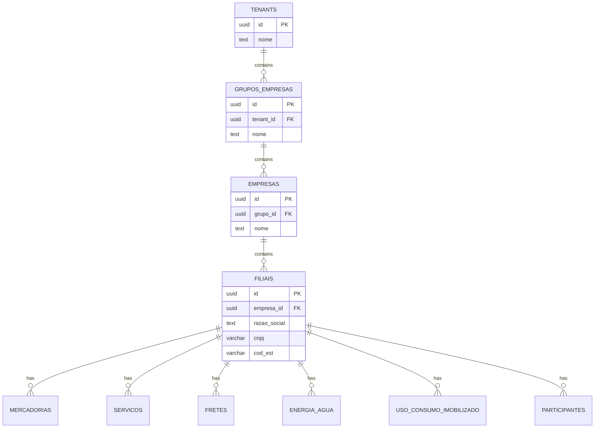
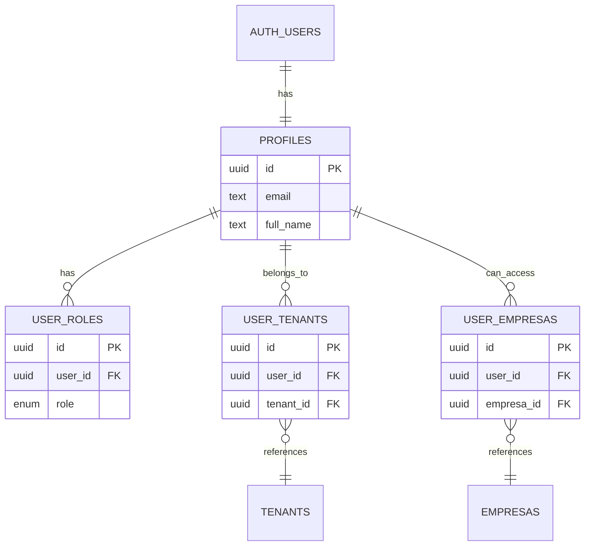
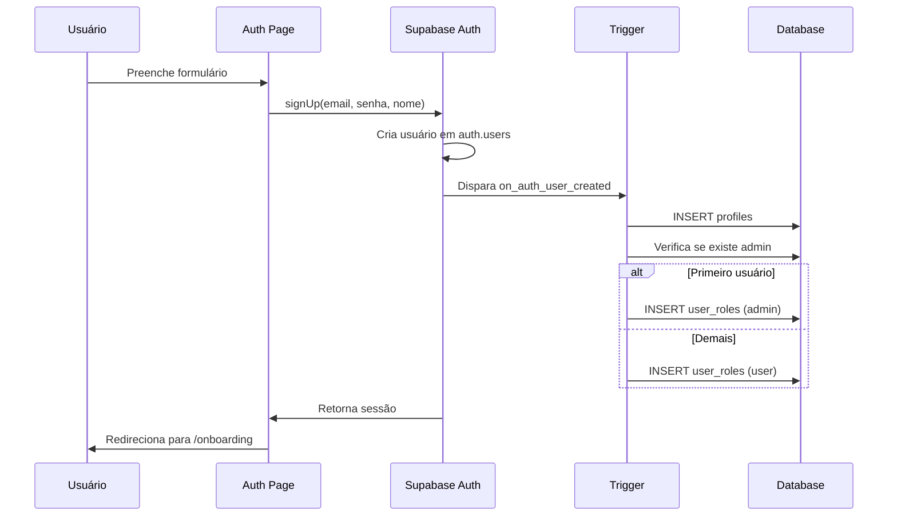
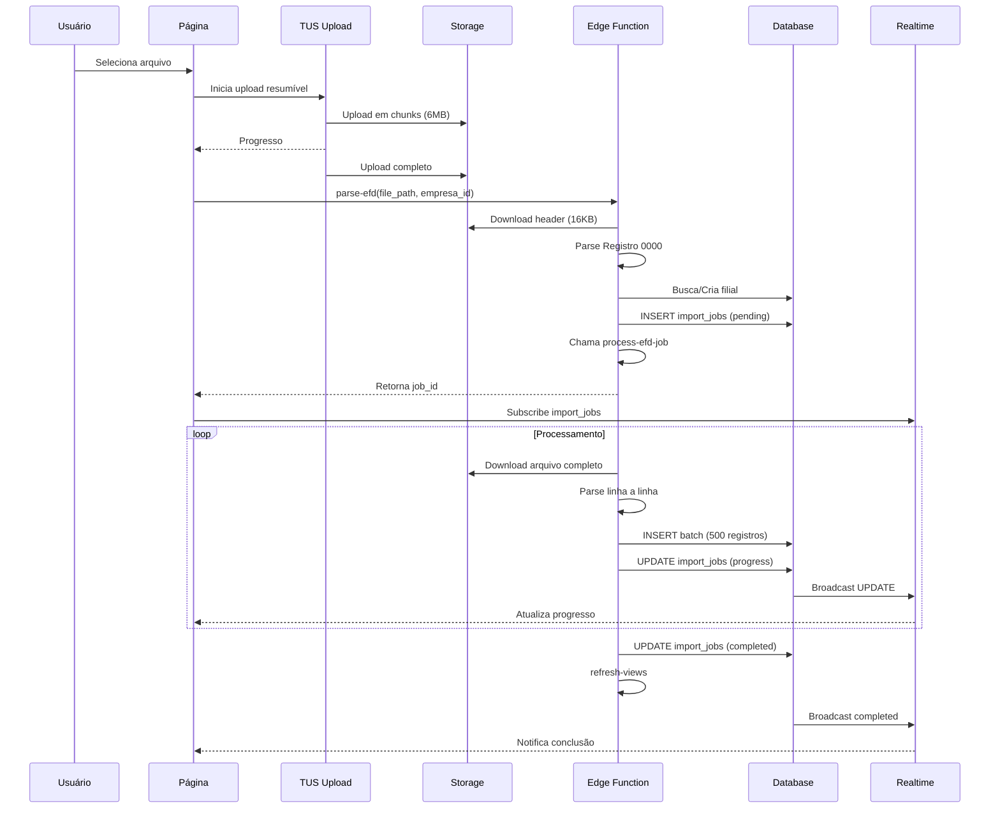

# 🏛️ Sistema de Gestão da Reforma Tributária Brasileira
## Documentação Técnica Completa - Engenharia Reversa

> **Versão**: 2.0.0  
> **Última Atualização**: Janeiro 2026  
> **Propósito**: Documentação abrangente para reconstrução, manutenção e evolução do sistema

---

## 📑 Índice

1. [Visão Geral do Sistema](#1-visão-geral-do-sistema)
2. [Stack Tecnológica](#2-stack-tecnológica)
3. [Arquitetura de Alto Nível](#3-arquitetura-de-alto-nível)
4. [Estrutura de Navegação e Rotas](#4-estrutura-de-navegação-e-rotas)
5. [Modelo de Dados](#5-modelo-de-dados)
6. [Sistema de Autenticação e Autorização](#6-sistema-de-autenticação-e-autorização)
7. [Edge Functions](#7-edge-functions)
8. [Fluxo de Importação de Arquivos EFD](#8-fluxo-de-importação-de-arquivos-efd)
9. [Layouts EFD Suportados](#9-layouts-efd-suportados)
10. [Lógica de Projeção Tributária](#10-lógica-de-projeção-tributária)
11. [Componentes React Principais](#11-componentes-react-principais)
12. [Hooks Customizados](#12-hooks-customizados)
13. [Bibliotecas e Dependências](#13-bibliotecas-e-dependências)
14. [Storage e Upload de Arquivos](#14-storage-e-upload-de-arquivos)
15. [Realtime e Subscriptions](#15-realtime-e-subscriptions)
16. [Variáveis de Ambiente](#16-variáveis-de-ambiente)
17. [Diagramas de Arquitetura](#17-diagramas-de-arquitetura)
18. [Guia de Reconstrução](#18-guia-de-reconstrução)

---

## 1. Visão Geral do Sistema

### 1.1 Propósito

O **Sistema de Gestão da Reforma Tributária Brasileira** é uma aplicação web projetada para:

1. **Importar arquivos fiscais** (EFD Contribuições e EFD ICMS/IPI)
2. **Calcular impostos atuais** (PIS, COFINS, ICMS, ISS, IPI)
3. **Simular a transição tributária** do modelo atual para IBS/CBS (2027-2033)
4. **Projetar impactos financeiros** da reforma tributária nas operações
5. **Fornecer dashboards analíticos** para tomada de decisão

### 1.2 Público-Alvo

- Contadores e escritórios de contabilidade
- Departamentos fiscais de empresas
- Consultores tributários
- Gestores financeiros

### 1.3 Contexto da Reforma Tributária

A reforma tributária brasileira (EC 132/2023) prevê:

| Período | Fase |
|---------|------|
| 2027-2028 | Teste: alíquotas de 0.1% IBS + 0.9% CBS |
| 2029-2032 | Transição gradual: redução ICMS 10% a 40% ao ano |
| 2033+ | Extinção completa de ICMS, PIS e COFINS |

### 1.4 Tipos de Operações Suportadas

| Categoria | Descrição | Tabela |
|-----------|-----------|--------|
| Mercadorias | Compra e venda de produtos | `mercadorias` |
| Serviços | Prestação e tomada de serviços | `servicos` |
| Fretes | Transporte de cargas | `fretes` |
| Energia/Água | Utilidades e telecomunicações | `energia_agua` |
| Uso/Consumo | Material de uso, consumo e ativo imobilizado | `uso_consumo_imobilizado` |

---

## 2. Stack Tecnológica

### 2.1 Frontend

| Tecnologia | Versão | Propósito |
|------------|--------|-----------|
| React | 18.3.1 | Framework de UI |
| TypeScript | 5.x | Tipagem estática |
| Vite | 5.x | Build tool e dev server |
| Tailwind CSS | 3.x | Estilização utility-first |
| shadcn/ui | Latest | Componentes de UI |
| Radix UI | Latest | Primitivos de acessibilidade |

### 2.2 Backend (Lovable Cloud / Supabase)

| Componente | Propósito |
|------------|-----------|
| PostgreSQL | Banco de dados relacional |
| Edge Functions | Lógica de servidor (Deno) |
| Row Level Security | Segurança em nível de linha |
| Storage | Armazenamento de arquivos |
| Realtime | Atualizações em tempo real |
| Auth | Autenticação de usuários |

### 2.3 Bibliotecas Principais

```json
{
  "ui": ["@radix-ui/*", "lucide-react", "recharts", "sonner"],
  "forms": ["react-hook-form", "zod", "@hookform/resolvers"],
  "data": ["@tanstack/react-query", "@supabase/supabase-js"],
  "routing": ["react-router-dom"],
  "upload": ["tus-js-client"],
  "export": ["xlsx"],
  "utils": ["date-fns", "clsx", "tailwind-merge"]
}
```

---

## 3. Arquitetura de Alto Nível

### 3.1 Visão Geral

```
┌─────────────────────────────────────────────────────────────────┐
│                        FRONTEND (React)                         │
├─────────────────────────────────────────────────────────────────┤
│  ┌──────────┐  ┌──────────┐  ┌──────────┐  ┌──────────────────┐ │
│  │  Pages   │  │Components│  │  Hooks   │  │ Integrations     │ │
│  │ (18)     │  │ (50+)    │  │ (6)      │  │ (Supabase)       │ │
│  └──────────┘  └──────────┘  └──────────┘  └──────────────────┘ │
└─────────────────────────────────────────────────────────────────┘
                              │
                              ▼
┌─────────────────────────────────────────────────────────────────┐
│                    LOVABLE CLOUD (Backend)                      │
├─────────────────────────────────────────────────────────────────┤
│  ┌──────────────┐  ┌──────────────┐  ┌──────────────────────┐  │
│  │ Edge Funcs   │  │  PostgreSQL  │  │     Storage          │  │
│  │ (14)         │  │  + RLS       │  │     (efd-files)      │  │
│  └──────────────┘  └──────────────┘  └──────────────────────┘  │
│  ┌──────────────┐  ┌──────────────┐  ┌──────────────────────┐  │
│  │ Auth         │  │  Realtime    │  │     Functions        │  │
│  │ (JWT)        │  │  (WebSocket) │  │     (24 RPCs)        │  │
│  └──────────────┘  └──────────────┘  └──────────────────────┘  │
└─────────────────────────────────────────────────────────────────┘
```

### 3.2 Fluxo de Dados Principal

```
Usuário → Página → Hook → Supabase Client → Edge Function/RPC → PostgreSQL
                                                                    │
                                                                    ▼
Usuário ← Componente ← Estado (TanStack Query) ← Resposta ← Materialzed Views
```

### 3.3 Padrão de Multi-Tenancy

O sistema implementa isolamento de dados em 4 níveis hierárquicos:

```
Tenant (Ambiente)
    └── Grupo de Empresas
            └── Empresa
                    └── Filial (Estabelecimento)
```

Cada nível possui controle de acesso via RLS (Row Level Security).

---

## 4. Estrutura de Navegação e Rotas

### 4.1 Mapa de Rotas

| Rota | Componente | Layout | Acesso | Descrição |
|------|------------|--------|--------|-----------|
| `/` | `Index` | Nenhum | Público | Redirect para auth/dashboard |
| `/auth` | `Auth` | Nenhum | Público | Login, cadastro, recuperação |
| `/reset-password` | `ResetPassword` | Nenhum | Público | Redefinir senha |
| `/onboarding` | `Onboarding` | Nenhum/App | Admin | Configuração inicial |
| `/dashboard` | `Dashboard` | AppLayout | Autenticado | Dashboard principal |
| `/dashboard-uso-consumo` | `DashboardUsoConsumo` | AppLayout | Autenticado | Dashboard Uso/Consumo |
| `/mercadorias` | `Mercadorias` | AppLayout | Autenticado | Painel de mercadorias |
| `/mercadorias-participante` | `MercadoriasParticipante` | AppLayout | Autenticado | Mercadorias por participante |
| `/servicos` | `Servicos` | AppLayout | Autenticado | Painel de serviços |
| `/energia-agua` | `EnergiaAgua` | AppLayout | Autenticado | Painel de utilidades |
| `/fretes` | `Fretes` | AppLayout | Autenticado | Painel de fretes |
| `/uso-consumo` | `UsoConsumoImobilizado` | AppLayout | Autenticado | Uso, consumo e imobilizado |
| `/aliquotas` | `Aliquotas` | AppLayout | Autenticado | Tabela de alíquotas |
| `/empresas` | `Empresas` | AppLayout | Admin | Gestão de empresas |
| `/configuracoes` | `Configuracoes` | AppLayout | Admin | Configurações do sistema |
| `/importar-efd` | `ImportarEFD` | AppLayout | Autenticado | Importar EFD Contribuições |
| `/importar-efd-icms` | `ImportarEFDIcms` | AppLayout | Autenticado | Importar EFD ICMS/IPI |
| `*` | `NotFound` | Nenhum | Público | Página 404 |

### 4.2 Estrutura do AppLayout

```tsx
<SidebarProvider>
  <div className="min-h-screen flex w-full">
    <AppSidebar />              {/* Menu lateral colapsável */}
    <main className="flex-1">
      <header>                  {/* Barra superior com trigger do sidebar */}
        <SidebarTrigger />
      </header>
      <div className="p-6">
        <Outlet />              {/* Conteúdo da página atual */}
      </div>
    </main>
  </div>
</SidebarProvider>
```

### 4.3 Menu de Navegação (AppSidebar)

```typescript
const allMenuItems = [
  { title: "Dashboard", url: "/dashboard", icon: LayoutDashboard },
  { title: "Mercadorias", url: "/mercadorias", icon: Package },
  { title: "Mercadorias/Part.", url: "/mercadorias-participante", icon: Users },
  { title: "Serviços", url: "/servicos", icon: FileText },
  { title: "Energia/Água", url: "/energia-agua", icon: Zap },
  { title: "Fretes", url: "/fretes", icon: Truck },
  { title: "Uso e Consumo", url: "/uso-consumo", icon: ShoppingBag },
  { title: "Dashboard U&C", url: "/dashboard-uso-consumo", icon: TrendingUp },
  { title: "Alíquotas", url: "/aliquotas", icon: Percent },
  { title: "Importar EFD", url: "/importar-efd", icon: Upload },
  { title: "Importar ICMS", url: "/importar-efd-icms", icon: Upload },
  { title: "Empresas", url: "/empresas", icon: Building2, adminOnly: true },
  { title: "Configurações", url: "/configuracoes", icon: Settings, adminOnly: true },
];
```

---

## 5. Modelo de Dados

### 5.1 Tabelas Principais (17 tabelas)

#### Hierarquia Organizacional

| Tabela | Colunas Principais | RLS | Descrição |
|--------|-------------------|-----|-----------|
| `tenants` | id, nome | Sim | Ambiente/organização de topo |
| `grupos_empresas` | id, nome, tenant_id | Sim | Agrupamento de empresas |
| `empresas` | id, nome, grupo_id | Sim | Empresas jurídicas |
| `filiais` | id, razao_social, cnpj, cod_est, empresa_id | Sim | Estabelecimentos/filiais |

#### Dados Transacionais

| Tabela | Colunas Principais | RLS | Descrição |
|--------|-------------------|-----|-----------|
| `mercadorias` | filial_id, mes_ano, tipo, valor, pis, cofins, icms, ipi, ncm, cod_part | Sim | Operações com mercadorias |
| `servicos` | filial_id, mes_ano, tipo, valor, pis, cofins, iss, ncm | Sim | Operações com serviços |
| `fretes` | filial_id, mes_ano, tipo, valor, pis, cofins, icms, ncm | Sim | Operações de transporte |
| `energia_agua` | filial_id, mes_ano, tipo_operacao, tipo_servico, valor, pis, cofins, icms | Sim | Utilidades |
| `uso_consumo_imobilizado` | filial_id, mes_ano, tipo_operacao, cfop, valor, icms, pis, cofins, cod_part | Sim | Uso, consumo e imobilizado |
| `participantes` | filial_id, cod_part, nome, cnpj, cpf | Sim | Parceiros comerciais |

#### Gestão de Usuários

| Tabela | Colunas Principais | RLS | Descrição |
|--------|-------------------|-----|-----------|
| `profiles` | id (auth.users), email, full_name | Sim | Perfis de usuário |
| `user_roles` | user_id, role (admin/user/viewer) | Sim | Papéis de usuário |
| `user_tenants` | user_id, tenant_id | Sim | Vínculo usuário-tenant |
| `user_empresas` | user_id, empresa_id | Sim | Vínculo usuário-empresa |

#### Suporte

| Tabela | Colunas Principais | RLS | Descrição |
|--------|-------------------|-----|-----------|
| `aliquotas` | ano, ibs_estadual, ibs_municipal, cbs, reduc_icms, reduc_piscofins | Sim | Alíquotas da reforma |
| `import_jobs` | id, user_id, empresa_id, filial_id, status, progress, file_path | Sim | Controle de importação |
| `audit_logs` | user_id, tenant_id, action, table_name, details | Sim | Auditoria |

### 5.2 Materialized Views (8 MVs)

As views materializadas otimizam consultas analíticas agregando dados por filial e período:

| View | Origem | Agregação | Colunas Principais |
|------|--------|-----------|-------------------|
| `mv_mercadorias_aggregated` | mercadorias | filial_id, mes_ano, tipo | valor, pis, cofins, icms |
| `mv_mercadorias_participante` | mercadorias + participantes | filial_id, mes_ano, cod_part | valor, pis, cofins, icms, participante_nome |
| `mv_fretes_aggregated` | fretes | filial_id, mes_ano, tipo | valor, pis, cofins, icms |
| `mv_energia_agua_aggregated` | energia_agua | filial_id, mes_ano, tipo_operacao, tipo_servico | valor, pis, cofins, icms |
| `mv_servicos_aggregated` | servicos | filial_id, mes_ano, tipo | valor, pis, cofins, iss |
| `mv_uso_consumo_aggregated` | uso_consumo_imobilizado | filial_id, mes_ano, tipo_operacao, cfop | valor, icms, pis, cofins |
| `mv_uso_consumo_detailed` | uso_consumo_imobilizado + participantes | filial_id, mes_ano, cod_part | valor, icms, pis, cofins, participante_nome |
| `mv_dashboard_stats` | todas as transacionais | filial_id, categoria, subtipo, mes_ano | valor, icms, pis, cofins |

### 5.3 Funções RPC (24 funções)

#### Funções de Segurança

```sql
-- Verificação de papel
has_role(_user_id uuid, _role app_role) → boolean

-- Verificação de acesso a tenant
has_tenant_access(_user_id uuid, _tenant_id uuid) → boolean

-- Verificação de acesso a empresa
has_empresa_access(_user_id uuid, _empresa_id uuid) → boolean

-- Verificação de acesso a filial
has_filial_access(_user_id uuid, _filial_id uuid) → boolean
```

#### Funções de Acesso a MVs

```sql
-- Acesso às views materializadas com RLS
get_mv_mercadorias_aggregated() → TABLE
get_mv_fretes_aggregated() → TABLE
get_mv_energia_agua_aggregated() → TABLE
get_mv_servicos_aggregated() → TABLE
get_mv_uso_consumo_aggregated() → TABLE
get_mv_uso_consumo_detailed() → TABLE
get_mv_dashboard_stats(_mes_ano date, _filial_id uuid) → TABLE
```

#### Funções de Paginação (Mercadorias por Participante)

```sql
-- Lista de participantes
get_mercadorias_participante_lista() → TABLE(cod_part, nome, cnpj)

-- Meses disponíveis
get_mercadorias_participante_meses() → TABLE(mes_ano)

-- Página de dados
get_mercadorias_participante_page(
  p_limit int, p_offset int, p_mes_ano date, 
  p_participante text, p_tipo text
) → TABLE

-- Totais agregados
get_mercadorias_participante_totals(p_mes_ano date, p_participante text) → TABLE
```

#### Funções de Deleção em Batch

```sql
-- Deleção segura com validação de acesso
delete_mercadorias_batch(_user_id uuid, _filial_ids uuid[], _batch_size int) → int
delete_fretes_batch(_user_id uuid, _filial_ids uuid[], _batch_size int) → int
delete_energia_agua_batch(_user_id uuid, _filial_ids uuid[], _batch_size int) → int
delete_servicos_batch(_user_id uuid, _filial_ids uuid[], _batch_size int) → int
delete_uso_consumo_batch(_user_id uuid, _filial_ids uuid[], _batch_size int) → int
```

#### Funções de Manutenção

```sql
-- Atualização de timestamp
update_updated_at_column() → TRIGGER

-- Tratamento de novo usuário
handle_new_user() → TRIGGER

-- Refresh de views
refresh_materialized_views() → void
refresh_materialized_views_async() → void
```

### 5.4 Esquema de Relacionamentos (ER Simplificado)

```
tenants
    │
    └──< grupos_empresas
            │
            └──< empresas
                    │
                    └──< filiais
                            │
                            ├──< mercadorias
                            ├──< servicos
                            ├──< fretes
                            ├──< energia_agua
                            ├──< uso_consumo_imobilizado
                            └──< participantes

auth.users
    │
    └──< profiles (1:1)
            │
            ├──< user_roles (1:N)
            ├──< user_tenants (N:M com tenants)
            └──< user_empresas (N:M com empresas)
```

---

## 6. Sistema de Autenticação e Autorização

### 6.1 Fluxo de Cadastro

```
1. Usuário preenche formulário (email, senha, nome)
2. supabase.auth.signUp() cria usuário em auth.users
3. Trigger handle_new_user() é acionado:
   a. Cria registro em profiles
   b. Verifica se existe admin no sistema
   c. Primeiro usuário → role 'admin'
   d. Demais usuários → role 'user'
4. Usuário é redirecionado para /onboarding
```

### 6.2 Fluxo de Onboarding (Admin)

```
1. Admin acessa /onboarding
2. Opções:
   a. Criar novo ambiente (tenant)
   b. Entrar em ambiente existente (via código)
3. Se criar novo:
   a. Cria tenant
   b. Cria grupo_empresas padrão
   c. Cria empresa padrão
   d. Vincula usuário ao tenant (user_tenants)
4. Edge function onboarding-complete finaliza
```

### 6.3 Hierarquia de Papéis

| Papel | Permissões |
|-------|-----------|
| `admin` | Acesso total: criar tenants, grupos, empresas, filiais, gerenciar usuários |
| `user` | Acesso às empresas vinculadas: visualizar e operar dados |
| `viewer` | Apenas visualização (não implementado ainda) |

### 6.4 Row Level Security (RLS)

Todas as 17 tabelas possuem RLS habilitado. Padrão de políticas:

```sql
-- Exemplo: mercadorias
CREATE POLICY "Users can view mercadorias of their filiais"
ON mercadorias FOR SELECT
USING (has_filial_access(auth.uid(), filial_id));

CREATE POLICY "Users can insert mercadorias for their filiais"
ON mercadorias FOR INSERT
WITH CHECK (has_filial_access(auth.uid(), filial_id));

CREATE POLICY "Users can update mercadorias of their filiais"
ON mercadorias FOR UPDATE
USING (has_filial_access(auth.uid(), filial_id));

CREATE POLICY "Users can delete mercadorias of their filiais"
ON mercadorias FOR DELETE
USING (has_filial_access(auth.uid(), filial_id));
```

### 6.5 Cadeia de Verificação de Acesso

```
has_filial_access(user_id, filial_id)
    │
    ├── Busca filial → empresa → grupo → tenant
    ├── Verifica user_tenants (usuário tem acesso ao tenant?)
    └── Verifica has_empresa_access(user_id, empresa_id)
            │
            ├── Se admin: acesso a todas empresas do tenant
            └── Se user: verifica user_empresas
```

---

## 7. Edge Functions

### 7.1 Catálogo de Funções (14 funções)

| Função | Método | Propósito | Autenticação |
|--------|--------|-----------|--------------|
| `parse-efd` | POST | Iniciar importação EFD Contribuições | Obrigatória |
| `process-efd-job` | POST | Processar arquivo EFD em background | Service Role |
| `parse-efd-icms` | POST | Iniciar importação EFD ICMS/IPI | Obrigatória |
| `process-efd-icms-job` | POST | Processar EFD ICMS em background | Service Role |
| `cancel-import-job` | POST | Cancelar importação em andamento | Obrigatória |
| `clear-imported-data` | POST | Limpar dados importados (EFD Contrib) | Obrigatória |
| `clear-icms-data` | POST | Limpar dados ICMS importados | Obrigatória |
| `refresh-views` | POST | Atualizar materialized views | Obrigatória |
| `onboarding-complete` | POST | Finalizar processo de onboarding | Obrigatória |
| `join-tenant` | POST | Entrar em tenant existente via código | Obrigatória |
| `get-tenant-structure` | GET | Obter estrutura do tenant atual | Obrigatória |
| `send-password-reset` | POST | Enviar email de reset de senha | Público |
| `send-import-email` | POST | Notificar conclusão de importação | Service Role |
| `reset-all-data` | POST | Reset completo (desenvolvimento) | Admin |

### 7.2 Estrutura Padrão de Edge Function

```typescript
// supabase/functions/nome-funcao/index.ts
import { serve } from "https://deno.land/std@0.168.0/http/server.ts";
import { createClient } from "https://esm.sh/@supabase/supabase-js@2";

const corsHeaders = {
  'Access-Control-Allow-Origin': '*',
  'Access-Control-Allow-Headers': 'authorization, x-client-info, apikey, content-type',
};

serve(async (req) => {
  // Handle CORS preflight
  if (req.method === 'OPTIONS') {
    return new Response(null, { headers: corsHeaders });
  }

  try {
    // Autenticação
    const authHeader = req.headers.get('Authorization');
    const supabase = createClient(
      Deno.env.get('SUPABASE_URL') ?? '',
      Deno.env.get('SUPABASE_ANON_KEY') ?? '',
      { global: { headers: { Authorization: authHeader! } } }
    );

    const { data: { user }, error: authError } = await supabase.auth.getUser();
    if (authError || !user) {
      throw new Error('Não autorizado');
    }

    // Lógica da função
    const body = await req.json();
    // ...

    return new Response(
      JSON.stringify({ success: true, data: result }),
      { headers: { ...corsHeaders, 'Content-Type': 'application/json' } }
    );

  } catch (error) {
    return new Response(
      JSON.stringify({ error: error.message }),
      { headers: { ...corsHeaders, 'Content-Type': 'application/json' }, status: 400 }
    );
  }
});
```

### 7.3 Fluxo parse-efd (EFD Contribuições)

```
1. Recebe: file_path, file_name, file_size, empresa_id, import_scope
2. Valida autenticação e acesso à empresa
3. Download dos primeiros 16KB do arquivo (header)
4. Parse do Registro 0000:
   - Extrai CNPJ, razão social, período
5. Busca ou cria filial pelo CNPJ
6. Cria registro em import_jobs (status: 'pending')
7. Chama process-efd-job em background
8. Retorna job_id para acompanhamento
```

### 7.4 Fluxo process-efd-job

```
1. Recebe: job_id
2. Atualiza status para 'processing'
3. Download do arquivo completo do Storage
4. Parse linha a linha:
   - Bloco 0: 0000, 0140 (filiais), 0150 (participantes)
   - Bloco A: A010, A100 (serviços)
   - Bloco C: C010, C100, C500, C600 (mercadorias)
   - Bloco D: D010, D100, D101, D105, D500, D501, D505 (fretes)
5. Inserção em batch (500 registros por vez)
6. Atualiza progress a cada 5%
7. Ao finalizar:
   - Status 'completed'
   - Chama refresh-views
   - Chama send-import-email
```

### 7.5 Fluxo parse-efd-icms (EFD ICMS/IPI)

```
1. Recebe: file_path, file_name, file_size, empresa_id
2. Valida autenticação e acesso
3. Parse do Registro 0000 (igual EFD Contrib)
4. Valida que existe EFD Contribuições para o período
5. Cria import_job
6. Chama process-efd-icms-job
```

### 7.6 Fluxo process-efd-icms-job

```
1. Parse específico para uso/consumo:
   - Bloco 0: 0000, 0150 (participantes)
   - Bloco C: C100 (documentos), C170 (itens)
2. Filtra por CFOPs:
   - 1551, 2551: Uso e Consumo
   - 1556, 2556: Ativo Imobilizado
3. Extrai ICMS, PIS, COFINS dos itens
4. Agrupa por documento
5. Insere em uso_consumo_imobilizado
```

---

## 8. Fluxo de Importação de Arquivos EFD

### 8.1 Visão Geral

```
┌──────────┐    ┌──────────┐    ┌──────────┐    ┌──────────┐
│  Upload  │───▶│  Parse   │───▶│ Process  │───▶│ Refresh  │
│  (TUS)   │    │  Header  │    │  Job     │    │  Views   │
└──────────┘    └──────────┘    └──────────┘    └──────────┘
     │               │               │               │
     ▼               ▼               ▼               ▼
  Storage      import_jobs     Tabelas de     Materialized
 efd-files     (pending)       Transação        Views
```

### 8.2 Upload Resumível (TUS Protocol)

O sistema utiliza o protocolo TUS para uploads grandes e resumíveis:

```typescript
// src/hooks/useResumableUpload.tsx
import * as tus from 'tus-js-client';

const upload = new tus.Upload(file, {
  endpoint: `${SUPABASE_URL}/storage/v1/upload/resumable`,
  retryDelays: [0, 3000, 5000, 10000, 20000],
  headers: {
    authorization: `Bearer ${session.access_token}`,
    'x-upsert': 'true',
  },
  uploadDataDuringCreation: true,
  removeFingerprintOnSuccess: true,
  metadata: {
    bucketName: 'efd-files',
    objectName: `${user.id}/${timestamp}_${file.name}`,
    contentType: 'text/plain',
    cacheControl: '3600',
  },
  chunkSize: 6 * 1024 * 1024, // 6MB chunks
  onProgress: (bytesUploaded, bytesTotal) => {
    setProgress(Math.round((bytesUploaded / bytesTotal) * 100));
  },
  onSuccess: () => {
    // Chama parse-efd
  },
  onError: (error) => {
    // Tratamento de erro
  },
});
```

### 8.3 Estados do Import Job

| Status | Descrição | Próximo Estado |
|--------|-----------|----------------|
| `pending` | Aguardando processamento | `processing` |
| `processing` | Processando arquivo | `completed` / `failed` |
| `completed` | Concluído com sucesso | - |
| `failed` | Falha no processamento | - |
| `cancelled` | Cancelado pelo usuário | - |

### 8.4 Acompanhamento em Tempo Real

```typescript
// Subscription para atualizações de progresso
useEffect(() => {
  const channel = supabase
    .channel('import-jobs-realtime')
    .on(
      'postgres_changes',
      {
        event: '*',
        schema: 'public',
        table: 'import_jobs',
        filter: `user_id=eq.${user.id}`,
      },
      (payload) => {
        // Atualiza estado local
        if (payload.eventType === 'UPDATE') {
          updateJob(payload.new);
        }
      }
    )
    .subscribe();

  return () => supabase.removeChannel(channel);
}, [user.id]);
```

---

## 9. Layouts EFD Suportados

### 9.1 EFD Contribuições (PIS/COFINS)

#### Bloco 0 - Identificação

| Registro | Campo | Posição | Descrição |
|----------|-------|---------|-----------|
| 0000 | REG | 1 | "0000" |
| 0000 | COD_VER | 2 | Versão do layout |
| 0000 | TIPO_ESCRIT | 3 | 0=Original, 1=Retificadora |
| 0000 | DT_INI | 5 | Data inicial (DDMMAAAA) |
| 0000 | DT_FIN | 6 | Data final (DDMMAAAA) |
| 0000 | NOME | 7 | Razão social |
| 0000 | CNPJ | 8 | CNPJ do declarante |
| 0140 | REG | 1 | "0140" |
| 0140 | COD_EST | 2 | Código do estabelecimento |
| 0140 | NOME | 3 | Nome do estabelecimento |
| 0140 | CNPJ | 4 | CNPJ do estabelecimento |
| 0150 | REG | 1 | "0150" |
| 0150 | COD_PART | 2 | Código do participante |
| 0150 | NOME | 3 | Nome do participante |
| 0150 | CNPJ | 5 | CNPJ do participante |
| 0150 | CPF | 6 | CPF do participante |

#### Bloco A - Serviços

| Registro | Campos Relevantes |
|----------|-------------------|
| A010 | COD_EST (estabelecimento atual) |
| A100 | DT_DOC, VL_DOC, IND_OPER (0=Entrada, 1=Saída) |

#### Bloco C - Mercadorias

| Registro | Campos Relevantes |
|----------|-------------------|
| C010 | COD_EST |
| C100 | DT_DOC, VL_DOC, VL_ICMS, COD_PART, IND_OPER |
| C170 | VL_ITEM, VL_PIS, VL_COFINS, NCM, CFOP |
| C500 | Energia elétrica (DT_DOC, VL_DOC, VL_ICMS) |
| C600 | Consolidação energia/água |

#### Bloco D - Transporte

| Registro | Campos Relevantes |
|----------|-------------------|
| D010 | COD_EST |
| D100 | DT_DOC, VL_DOC, VL_ICMS, IND_OPER |
| D101 | VL_PIS, CST_PIS |
| D105 | VL_COFINS, CST_COFINS |
| D500 | Telecomunicações |
| D501/D505 | PIS/COFINS telecomunicações |

### 9.2 EFD ICMS/IPI

#### Bloco 0 - Identificação

| Registro | Campo | Posição | Descrição |
|----------|-------|---------|-----------|
| 0000 | REG | 1 | "0000" |
| 0000 | DT_INI | 4 | Data inicial (DDMMAAAA) |
| 0000 | DT_FIN | 5 | Data final |
| 0000 | NOME | 6 | Razão social |
| 0000 | CNPJ | 7 | CNPJ do declarante |
| 0150 | COD_PART | 2 | Código do participante |
| 0150 | NOME | 3 | Nome |
| 0150 | CNPJ | 5 | CNPJ |
| 0150 | CPF | 6 | CPF |

#### Bloco C - Mercadorias (Uso/Consumo)

| Registro | Campos Relevantes |
|----------|-------------------|
| C100 | IND_OPER, COD_PART, NUM_DOC, DT_DOC, VL_DOC |
| C170 | CFOP, VL_ITEM, VL_ICMS, VL_PIS, VL_COFINS |

#### CFOPs de Uso, Consumo e Imobilizado

| CFOP | Tipo | Descrição |
|------|------|-----------|
| 1551 | Uso/Consumo | Compra material uso/consumo (mesmo estado) |
| 2551 | Uso/Consumo | Compra material uso/consumo (outro estado) |
| 1556 | Imobilizado | Compra ativo imobilizado (mesmo estado) |
| 2556 | Imobilizado | Compra ativo imobilizado (outro estado) |

---

## 10. Lógica de Projeção Tributária

### 10.1 Conceito

O sistema projeta o impacto da transição tributária calculando:

1. **Impostos Atuais**: ICMS, PIS, COFINS (valores do arquivo EFD)
2. **Impostos Projetados**: ICMS reduzido, PIS/COFINS reduzidos, IBS, CBS
3. **Diferença**: Impacto financeiro da transição

### 10.2 Tabela de Alíquotas (2027-2033)

```typescript
const aliquotas = [
  { ano: 2027, ibs_estadual: 0.1, ibs_municipal: 0.1, cbs: 0.9, reduc_icms: 0, reduc_piscofins: 0 },
  { ano: 2028, ibs_estadual: 0.1, ibs_municipal: 0.1, cbs: 0.9, reduc_icms: 0, reduc_piscofins: 0 },
  { ano: 2029, ibs_estadual: 1.3, ibs_municipal: 0.7, cbs: 7.95, reduc_icms: 10, reduc_piscofins: 0 },
  { ano: 2030, ibs_estadual: 2.6, ibs_municipal: 1.4, cbs: 7.95, reduc_icms: 20, reduc_piscofins: 0 },
  { ano: 2031, ibs_estadual: 3.9, ibs_municipal: 2.1, cbs: 7.95, reduc_icms: 30, reduc_piscofins: 0 },
  { ano: 2032, ibs_estadual: 5.2, ibs_municipal: 2.8, cbs: 7.95, reduc_icms: 40, reduc_piscofins: 0 },
  { ano: 2033, ibs_estadual: 6.5, ibs_municipal: 3.5, cbs: 8.8, reduc_icms: 100, reduc_piscofins: 100 },
];
```

### 10.3 Fórmulas de Cálculo

```typescript
function calcularProjecao(registro: DadosTransacionais, aliquota: Aliquota) {
  // 1. ICMS Projetado (com redução gradual)
  const icmsProjetado = registro.icms * (1 - aliquota.reduc_icms / 100);

  // 2. PIS/COFINS Projetados (com redução gradual)
  const pisCofinsSoma = registro.pis + registro.cofins;
  const pisCofinsProjetado = pisCofinsSoma * (1 - aliquota.reduc_piscofins / 100);

  // 3. Base de cálculo para IBS/CBS (valor líquido)
  const baseIbsCbs = registro.valor - registro.icms - registro.pis - registro.cofins;

  // 4. IBS Projetado (estadual + municipal)
  const aliquotaIbs = (aliquota.ibs_estadual + aliquota.ibs_municipal) / 100;
  const ibsProjetado = baseIbsCbs * aliquotaIbs;

  // 5. CBS Projetado
  const cbsProjetado = baseIbsCbs * (aliquota.cbs / 100);

  // 6. Total da Reforma
  const totalReforma = ibsProjetado + cbsProjetado;

  // 7. Total de Impostos com Reforma
  const totalImpostoReforma = icmsProjetado + pisCofinsProjetado + totalReforma;

  // 8. Impostos Atuais
  const impostosAtuais = registro.icms + registro.pis + registro.cofins;

  // 9. Diferença (impacto)
  const diferenca = totalImpostoReforma - impostosAtuais;

  return {
    icmsProjetado,
    pisCofinsProjetado,
    ibsProjetado,
    cbsProjetado,
    totalReforma,
    totalImpostoReforma,
    impostosAtuais,
    diferenca,
    percentualVariacao: ((diferenca / impostosAtuais) * 100).toFixed(2),
  };
}
```

### 10.4 Exemplo Prático

```
Dados Originais:
- Valor: R$ 100.000,00
- ICMS: R$ 18.000,00 (18%)
- PIS: R$ 1.650,00 (1,65%)
- COFINS: R$ 7.600,00 (7,6%)

Projeção 2030 (reduc_icms: 20%, ibs: 4%, cbs: 7,95%):

1. ICMS Projetado = 18.000 × (1 - 0.20) = R$ 14.400,00
2. PIS/COFINS Projetado = 9.250 × (1 - 0) = R$ 9.250,00
3. Base IBS/CBS = 100.000 - 18.000 - 9.250 = R$ 72.750,00
4. IBS = 72.750 × 0.04 = R$ 2.910,00
5. CBS = 72.750 × 0.0795 = R$ 5.783,63
6. Total Reforma = 2.910 + 5.783,63 = R$ 8.693,63
7. Total Imposto Reforma = 14.400 + 9.250 + 8.693,63 = R$ 32.343,63
8. Impostos Atuais = 18.000 + 9.250 = R$ 27.250,00
9. Diferença = 32.343,63 - 27.250 = R$ 5.093,63 (+18,7%)
```

### 10.5 Visualização no Dashboard

O Dashboard principal exibe:

1. **Cards de Resumo**: Valor total, ICMS, PIS, COFINS
2. **Gráfico de Evolução**: Projeção ano a ano (2027-2033)
3. **Tabela Comparativa**: Atual vs Projetado por categoria
4. **Filtros**: Por mês, filial, tipo de operação

---

## 11. Componentes React Principais

### 11.1 Estrutura de Diretórios

```
src/
├── components/
│   ├── ui/                    # shadcn/ui components (50+)
│   ├── AppLayout.tsx          # Layout principal com sidebar
│   ├── AppSidebar.tsx         # Menu lateral de navegação
│   ├── AdminRoute.tsx         # Proteção de rotas admin
│   ├── NavLink.tsx            # Link de navegação ativo
│   └── UploadProgress.tsx     # Barra de progresso de upload
├── pages/
│   ├── Auth.tsx               # Autenticação
│   ├── Dashboard.tsx          # Dashboard principal
│   ├── DashboardUsoConsumo.tsx # Dashboard U&C
│   ├── Mercadorias.tsx        # Painel mercadorias
│   ├── MercadoriasParticipante.tsx
│   ├── Servicos.tsx           # Painel serviços
│   ├── EnergiaAgua.tsx        # Painel utilidades
│   ├── Fretes.tsx             # Painel fretes
│   ├── UsoConsumoImobilizado.tsx # Painel uso/consumo
│   ├── Aliquotas.tsx          # Tabela alíquotas
│   ├── Empresas.tsx           # Gestão empresas (admin)
│   ├── Configuracoes.tsx      # Configurações (admin)
│   ├── ImportarEFD.tsx        # Importar EFD Contrib
│   ├── ImportarEFDIcms.tsx    # Importar EFD ICMS
│   ├── Onboarding.tsx         # Setup inicial
│   ├── ResetPassword.tsx      # Reset de senha
│   └── NotFound.tsx           # Página 404
├── hooks/
│   ├── useAuth.tsx            # Autenticação
│   ├── useRole.tsx            # Papéis/permissões
│   ├── useSessionInfo.tsx     # Info da sessão
│   ├── useResumableUpload.tsx # Upload TUS
│   └── use-mobile.tsx         # Detecção mobile
├── lib/
│   ├── utils.ts               # Utilitários (cn, etc)
│   ├── exportToExcel.ts       # Exportação XLSX
│   └── formatFilial.ts        # Formatação de filial
└── integrations/
    └── supabase/
        ├── client.ts          # Cliente Supabase
        └── types.ts           # Tipos do banco
```

### 11.2 Padrão de Página de Dados

```tsx
// Estrutura padrão de uma página de listagem/análise
export default function PaginaDados() {
  // 1. Hooks de autenticação e sessão
  const { user } = useAuth();
  const { isAdmin } = useRole();
  const { tenant, empresas } = useSessionInfo();

  // 2. Estados locais
  const [selectedMes, setSelectedMes] = useState<string>('');
  const [selectedFilial, setSelectedFilial] = useState<string>('');
  const [activeTab, setActiveTab] = useState('entrada');

  // 3. Queries com TanStack Query
  const { data: dados, isLoading } = useQuery({
    queryKey: ['dados', selectedMes, selectedFilial],
    queryFn: async () => {
      const { data, error } = await supabase
        .rpc('get_mv_dados_aggregated');
      if (error) throw error;
      return data;
    },
  });

  // 4. Cálculos derivados
  const totais = useMemo(() => calcularTotais(dados), [dados]);
  const projecoes = useMemo(() => calcularProjecoes(dados), [dados]);

  // 5. Renderização
  return (
    <div className="space-y-6">
      {/* Header com título e filtros */}
      <div className="flex justify-between items-center">
        <h1>Título da Página</h1>
        <div className="flex gap-4">
          <Select value={selectedMes} onValueChange={setSelectedMes}>
            {/* Opções de mês */}
          </Select>
          <Select value={selectedFilial} onValueChange={setSelectedFilial}>
            {/* Opções de filial */}
          </Select>
          <Button onClick={exportarExcel}>
            <Download className="mr-2 h-4 w-4" />
            Exportar
          </Button>
        </div>
      </div>

      {/* Cards de resumo */}
      <div className="grid grid-cols-4 gap-4">
        <Card>
          <CardHeader>
            <CardTitle>Valor Total</CardTitle>
          </CardHeader>
          <CardContent>
            {formatCurrency(totais.valor)}
          </CardContent>
        </Card>
        {/* Mais cards... */}
      </div>

      {/* Tabs de entrada/saída */}
      <Tabs value={activeTab} onValueChange={setActiveTab}>
        <TabsList>
          <TabsTrigger value="entrada">Entradas</TabsTrigger>
          <TabsTrigger value="saida">Saídas</TabsTrigger>
        </TabsList>
        <TabsContent value="entrada">
          <DataTable data={dadosEntrada} columns={columns} />
        </TabsContent>
        <TabsContent value="saida">
          <DataTable data={dadosSaida} columns={columns} />
        </TabsContent>
      </Tabs>
    </div>
  );
}
```

### 11.3 Componente AdminRoute

```tsx
// src/components/AdminRoute.tsx
export const AdminRoute = ({ children }: { children: React.ReactNode }) => {
  const { isAdmin, loading } = useRole();
  const navigate = useNavigate();

  useEffect(() => {
    if (!loading && !isAdmin) {
      navigate('/dashboard');
    }
  }, [isAdmin, loading, navigate]);

  if (loading) return <Skeleton />;
  if (!isAdmin) return null;

  return <>{children}</>;
};
```

### 11.4 Componente AppSidebar

```tsx
// src/components/AppSidebar.tsx
export function AppSidebar() {
  const { signOut } = useAuth();
  const { isAdmin } = useRole();
  const { tenant, grupo, empresas } = useSessionInfo();
  const { state } = useSidebar();
  const collapsed = state === 'collapsed';

  const menuItems = allMenuItems.filter(
    item => !item.adminOnly || isAdmin
  );

  return (
    <Sidebar>
      <SidebarHeader>
        {/* Logo e nome do sistema */}
      </SidebarHeader>
      <SidebarContent>
        <SidebarMenu>
          {menuItems.map((item) => (
            <SidebarMenuItem key={item.url}>
              <SidebarMenuButton asChild>
                <NavLink to={item.url}>
                  <item.icon className="h-4 w-4" />
                  <span>{item.title}</span>
                </NavLink>
              </SidebarMenuButton>
            </SidebarMenuItem>
          ))}
        </SidebarMenu>
      </SidebarContent>
      <SidebarFooter>
        {/* Info do usuário e botão de logout */}
        <Button onClick={signOut}>
          <LogOut className="h-4 w-4" />
          {!collapsed && <span>Sair</span>}
        </Button>
      </SidebarFooter>
    </Sidebar>
  );
}
```

---

## 12. Hooks Customizados

### 12.1 useAuth

```typescript
// src/hooks/useAuth.tsx
interface AuthContextType {
  user: User | null;
  session: Session | null;
  loading: boolean;
  signIn: (email: string, password: string) => Promise<{ error: Error | null }>;
  signUp: (email: string, password: string, fullName: string) => Promise<{ error: Error | null }>;
  signOut: () => Promise<void>;
  resetPassword: (email: string) => Promise<{ error: Error | null }>;
  updatePassword: (newPassword: string) => Promise<{ error: Error | null }>;
}

export function useAuth(): AuthContextType {
  const context = useContext(AuthContext);
  if (!context) {
    throw new Error('useAuth must be used within an AuthProvider');
  }
  return context;
}
```

### 12.2 useRole

```typescript
// src/hooks/useRole.tsx
interface RoleInfo {
  role: 'admin' | 'user' | 'viewer' | null;
  isAdmin: boolean;
  isUser: boolean;
  isViewer: boolean;
  loading: boolean;
}

export function useRole(): RoleInfo {
  const { user } = useAuth();
  const [roleInfo, setRoleInfo] = useState<RoleInfo>({
    role: null,
    isAdmin: false,
    isUser: false,
    isViewer: false,
    loading: true,
  });

  useEffect(() => {
    if (!user) return;

    const fetchRole = async () => {
      const { data } = await supabase
        .from('user_roles')
        .select('role')
        .eq('user_id', user.id)
        .single();

      setRoleInfo({
        role: data?.role ?? null,
        isAdmin: data?.role === 'admin',
        isUser: data?.role === 'user',
        isViewer: data?.role === 'viewer',
        loading: false,
      });
    };

    fetchRole();
  }, [user]);

  return roleInfo;
}
```

### 12.3 useSessionInfo

```typescript
// src/hooks/useSessionInfo.tsx
interface SessionInfo {
  tenant: Tenant | null;
  grupo: GrupoEmpresas | null;
  empresas: Empresa[];
  filiais: Filial[];
  loading: boolean;
}

export function useSessionInfo(): SessionInfo {
  const { user } = useAuth();
  const [info, setInfo] = useState<SessionInfo>({
    tenant: null,
    grupo: null,
    empresas: [],
    filiais: [],
    loading: true,
  });

  useEffect(() => {
    if (!user) return;

    const fetchInfo = async () => {
      // Busca tenant do usuário
      const { data: userTenant } = await supabase
        .from('user_tenants')
        .select('tenant:tenants(*)')
        .eq('user_id', user.id)
        .single();

      // Busca hierarquia completa
      const { data: grupos } = await supabase
        .from('grupos_empresas')
        .select(`
          *,
          empresas(
            *,
            filiais(*)
          )
        `)
        .eq('tenant_id', userTenant?.tenant?.id);

      setInfo({
        tenant: userTenant?.tenant ?? null,
        grupo: grupos?.[0] ?? null,
        empresas: grupos?.[0]?.empresas ?? [],
        filiais: grupos?.[0]?.empresas?.flatMap(e => e.filiais) ?? [],
        loading: false,
      });
    };

    fetchInfo();
  }, [user]);

  return info;
}
```

### 12.4 useResumableUpload

```typescript
// src/hooks/useResumableUpload.tsx
interface UploadState {
  progress: number;
  uploading: boolean;
  error: Error | null;
  filePath: string | null;
}

interface UseResumableUploadReturn {
  upload: (file: File) => void;
  cancel: () => void;
  state: UploadState;
}

export function useResumableUpload(): UseResumableUploadReturn {
  const { user, session } = useAuth();
  const [state, setState] = useState<UploadState>({
    progress: 0,
    uploading: false,
    error: null,
    filePath: null,
  });
  const uploadRef = useRef<tus.Upload | null>(null);

  const upload = useCallback((file: File) => {
    const timestamp = Date.now();
    const objectName = `${user!.id}/${timestamp}_${file.name}`;

    const tusUpload = new tus.Upload(file, {
      endpoint: `${SUPABASE_URL}/storage/v1/upload/resumable`,
      retryDelays: [0, 3000, 5000, 10000, 20000],
      headers: {
        authorization: `Bearer ${session!.access_token}`,
        'x-upsert': 'true',
      },
      metadata: {
        bucketName: 'efd-files',
        objectName,
        contentType: 'text/plain',
      },
      chunkSize: 6 * 1024 * 1024,
      onProgress: (bytesUploaded, bytesTotal) => {
        setState(s => ({
          ...s,
          progress: Math.round((bytesUploaded / bytesTotal) * 100),
        }));
      },
      onSuccess: () => {
        setState(s => ({
          ...s,
          uploading: false,
          filePath: objectName,
        }));
      },
      onError: (error) => {
        setState(s => ({
          ...s,
          uploading: false,
          error,
        }));
      },
    });

    uploadRef.current = tusUpload;
    setState(s => ({ ...s, uploading: true, error: null }));
    tusUpload.start();
  }, [user, session]);

  const cancel = useCallback(() => {
    uploadRef.current?.abort();
    setState(s => ({ ...s, uploading: false }));
  }, []);

  return { upload, cancel, state };
}
```

### 12.5 useMobile

```typescript
// src/hooks/use-mobile.tsx
export function useMobile(breakpoint: number = 768): boolean {
  const [isMobile, setIsMobile] = useState(
    typeof window !== 'undefined' ? window.innerWidth < breakpoint : false
  );

  useEffect(() => {
    const handleResize = () => {
      setIsMobile(window.innerWidth < breakpoint);
    };

    window.addEventListener('resize', handleResize);
    return () => window.removeEventListener('resize', handleResize);
  }, [breakpoint]);

  return isMobile;
}
```

---

## 13. Bibliotecas e Dependências

### 13.1 Dependências de Produção

| Pacote | Versão | Propósito |
|--------|--------|-----------|
| `react` | ^18.3.1 | Framework de UI |
| `react-dom` | ^18.3.1 | Renderização DOM |
| `react-router-dom` | ^6.30.1 | Roteamento SPA |
| `@supabase/supabase-js` | ^2.89.0 | Cliente Supabase |
| `@tanstack/react-query` | ^5.83.0 | Cache e fetching |
| `react-hook-form` | ^7.61.1 | Formulários |
| `zod` | ^3.25.76 | Validação de schemas |
| `@hookform/resolvers` | ^3.10.0 | Integração zod + rhf |
| `tus-js-client` | ^4.3.1 | Upload resumível |
| `xlsx` | ^0.18.5 | Exportação Excel |
| `recharts` | ^2.15.4 | Gráficos |
| `date-fns` | ^3.6.0 | Manipulação de datas |
| `sonner` | ^1.7.4 | Notificações toast |
| `lucide-react` | ^0.462.0 | Ícones |

### 13.2 Componentes UI (Radix + shadcn)

```
@radix-ui/react-accordion
@radix-ui/react-alert-dialog
@radix-ui/react-avatar
@radix-ui/react-checkbox
@radix-ui/react-dialog
@radix-ui/react-dropdown-menu
@radix-ui/react-label
@radix-ui/react-popover
@radix-ui/react-progress
@radix-ui/react-scroll-area
@radix-ui/react-select
@radix-ui/react-separator
@radix-ui/react-slider
@radix-ui/react-switch
@radix-ui/react-tabs
@radix-ui/react-toast
@radix-ui/react-tooltip
```

### 13.3 Utilitários de Estilo

| Pacote | Propósito |
|--------|-----------|
| `tailwindcss` | Utility-first CSS |
| `tailwindcss-animate` | Animações Tailwind |
| `tailwind-merge` | Merge de classes |
| `clsx` | Condicionais de classe |
| `class-variance-authority` | Variantes de componentes |

---

## 14. Storage e Upload de Arquivos

### 14.1 Bucket de Arquivos EFD

```sql
-- Configuração do bucket
INSERT INTO storage.buckets (id, name, public) 
VALUES ('efd-files', 'efd-files', false);
```

### 14.2 Políticas de Acesso

```sql
-- Upload: usuário pode fazer upload em sua pasta
CREATE POLICY "Users can upload to their folder"
ON storage.objects FOR INSERT
WITH CHECK (
  bucket_id = 'efd-files' AND
  auth.uid()::text = (storage.foldername(name))[1]
);

-- Download: usuário pode baixar de sua pasta
CREATE POLICY "Users can download from their folder"
ON storage.objects FOR SELECT
USING (
  bucket_id = 'efd-files' AND
  auth.uid()::text = (storage.foldername(name))[1]
);

-- Delete: usuário pode deletar de sua pasta
CREATE POLICY "Users can delete from their folder"
ON storage.objects FOR DELETE
USING (
  bucket_id = 'efd-files' AND
  auth.uid()::text = (storage.foldername(name))[1]
);
```

### 14.3 Estrutura de Pastas

```
efd-files/
├── {user_id_1}/
│   ├── 1704067200000_EFD_202401.txt
│   ├── 1706745600000_EFD_202402.txt
│   └── ...
├── {user_id_2}/
│   └── ...
└── ...
```

### 14.4 Limites

| Limite | Valor |
|--------|-------|
| Tamanho máximo por arquivo | 1 GB |
| Chunk size (TUS) | 6 MB |
| Tempo de expiração de URL assinada | 1 hora |

---

## 15. Realtime e Subscriptions

### 15.1 Tabelas com Realtime Habilitado

```sql
ALTER PUBLICATION supabase_realtime ADD TABLE import_jobs;
```

### 15.2 Padrão de Subscription

```typescript
// Exemplo: acompanhamento de importação
useEffect(() => {
  const channel = supabase
    .channel('import-progress')
    .on(
      'postgres_changes',
      {
        event: 'UPDATE',
        schema: 'public',
        table: 'import_jobs',
        filter: `id=eq.${jobId}`,
      },
      (payload) => {
        setProgress(payload.new.progress);
        setStatus(payload.new.status);
        
        if (payload.new.status === 'completed') {
          toast.success('Importação concluída!');
        } else if (payload.new.status === 'failed') {
          toast.error(payload.new.error_message);
        }
      }
    )
    .subscribe();

  return () => {
    supabase.removeChannel(channel);
  };
}, [jobId]);
```

### 15.3 Eventos Suportados

| Evento | Uso |
|--------|-----|
| `INSERT` | Novo job criado |
| `UPDATE` | Progresso atualizado |
| `DELETE` | Job removido |

---

## 16. Variáveis de Ambiente

### 16.1 Variáveis do Frontend (.env)

```env
# Supabase (gerenciado automaticamente pelo Lovable Cloud)
VITE_SUPABASE_URL=https://xxxxx.supabase.co
VITE_SUPABASE_PUBLISHABLE_KEY=eyJhbGciOiJIUzI1NiIsInR5cCI6IkpXVCJ9...
VITE_SUPABASE_PROJECT_ID=xxxxx
```

### 16.2 Secrets das Edge Functions

| Secret | Descrição | Uso |
|--------|-----------|-----|
| `SUPABASE_URL` | URL do projeto | Conexão com banco |
| `SUPABASE_ANON_KEY` | Chave anônima | Autenticação de usuário |
| `SUPABASE_SERVICE_ROLE_KEY` | Chave de serviço | Bypass de RLS |
| `SUPABASE_DB_URL` | Connection string | Conexão direta (se necessário) |
| `RESEND_API_KEY` | API do Resend | Envio de emails |

### 16.3 Acesso nas Edge Functions

```typescript
// Exemplo de uso de secrets
const supabaseUrl = Deno.env.get('SUPABASE_URL');
const serviceRoleKey = Deno.env.get('SUPABASE_SERVICE_ROLE_KEY');
const resendApiKey = Deno.env.get('RESEND_API_KEY');
```

---

## 17. Diagramas de Arquitetura

### 17.1 Hierarquia Organizacional



### 17.2 Gestão de Usuários



### 17.3 Fluxo de Autenticação



### 17.4 Fluxo de Importação EFD



### 17.5 Arquitetura de Projeção Tributária

```mermaid
flowchart TD
    subgraph Entrada
        A[Dados Transacionais] --> B[Valores: Valor, ICMS, PIS, COFINS]
        C[Tabela Alíquotas] --> D[Ano, IBS, CBS, Reduções]
    end
    
    subgraph Cálculo
        B --> E[ICMS Projetado]
        B --> F[PIS/COFINS Projetado]
        B --> G[Base IBS/CBS]
        D --> E
        D --> F
        G --> H[IBS]
        G --> I[CBS]
        D --> H
        D --> I
    end
    
    subgraph Resultado
        E --> J[Total Imposto Reforma]
        F --> J
        H --> J
        I --> J
        J --> K[Diferença vs Atual]
    end
    
    E[ICMS × (1 - reduc_icms%)]
    F[PIS+COFINS × (1 - reduc_piscofins%)]
    G[Valor - ICMS - PIS - COFINS]
    H[Base × (ibs_est + ibs_mun)%]
    I[Base × cbs%]
```

---

## 18. Guia de Reconstrução

### 18.1 Pré-requisitos

1. **Conta Lovable** com acesso ao Lovable Cloud
2. **Node.js** 18+ (para desenvolvimento local)
3. **Conhecimento** de React, TypeScript, Tailwind CSS

### 18.2 Passo a Passo

#### 1. Criar Projeto Base

```bash
# No Lovable, criar novo projeto React + Vite + TypeScript + Tailwind
```

#### 2. Instalar Dependências

```bash
# UI
npm install @radix-ui/react-* lucide-react recharts sonner

# Forms
npm install react-hook-form zod @hookform/resolvers

# Data
npm install @tanstack/react-query @supabase/supabase-js

# Utils
npm install date-fns clsx tailwind-merge class-variance-authority

# Upload
npm install tus-js-client

# Export
npm install xlsx
```

#### 3. Configurar Lovable Cloud

- Habilitar Lovable Cloud no projeto
- Executar migrations para criar tabelas
- Configurar secrets (RESEND_API_KEY)

#### 4. Criar Estrutura de Tabelas

Executar SQL de criação na ordem:
1. Extensões (uuid-ossp, pgcrypto)
2. Enums (app_role)
3. Tabelas de hierarquia (tenants → grupos → empresas → filiais)
4. Tabelas transacionais (mercadorias, servicos, fretes, energia_agua, uso_consumo)
5. Tabelas de usuários (profiles, user_roles, user_tenants, user_empresas)
6. Tabelas de suporte (aliquotas, import_jobs, audit_logs, participantes)
7. Funções de segurança (has_role, has_tenant_access, has_filial_access)
8. Políticas RLS (todas as tabelas)
9. Materialized Views (8 MVs)
10. Funções RPC (acesso às MVs, deleção batch)
11. Triggers (handle_new_user, update_updated_at)

#### 5. Criar Edge Functions

Deploy das 14 edge functions na ordem de dependência:
1. Funções básicas (onboarding-complete, join-tenant, get-tenant-structure)
2. Funções de importação (parse-efd, process-efd-job)
3. Funções ICMS (parse-efd-icms, process-efd-icms-job)
4. Funções de manutenção (refresh-views, clear-imported-data, clear-icms-data)
5. Funções de comunicação (send-password-reset, send-import-email)

#### 6. Criar Componentes Base

1. Configurar shadcn/ui
2. Criar hooks customizados (useAuth, useRole, useSessionInfo, useResumableUpload)
3. Criar componentes de layout (AppLayout, AppSidebar, AdminRoute)

#### 7. Criar Páginas

Ordem sugerida:
1. Auth (login, signup, forgot)
2. Onboarding
3. Dashboard (básico)
4. Mercadorias (modelo para outras páginas de dados)
5. Demais páginas de dados
6. Páginas de importação
7. Páginas administrativas

#### 8. Configurar Storage

1. Criar bucket `efd-files`
2. Configurar políticas de acesso
3. Testar upload resumível

#### 9. Habilitar Realtime

1. Adicionar `import_jobs` à publicação
2. Testar subscriptions

#### 10. Testes e Validação

1. Testar fluxo completo de cadastro
2. Testar importação de arquivos EFD
3. Verificar cálculos de projeção
4. Validar exportação Excel

---

## 📋 Checklist de Funcionalidades

- [x] Autenticação (login, signup, reset password)
- [x] Multi-tenancy com RLS
- [x] Onboarding (criar/entrar em ambiente)
- [x] Gestão de empresas e filiais
- [x] Importação EFD Contribuições
- [x] Importação EFD ICMS/IPI
- [x] Painel de Mercadorias
- [x] Painel de Mercadorias por Participante
- [x] Painel de Serviços
- [x] Painel de Fretes
- [x] Painel de Energia/Água
- [x] Painel de Uso e Consumo/Imobilizado
- [x] Dashboard principal com projeções
- [x] Dashboard de Uso e Consumo
- [x] Tabela de alíquotas
- [x] Exportação para Excel
- [x] Progresso de importação em tempo real
- [x] Notificação por email

---

## 🔐 Considerações de Segurança

1. **RLS em todas as tabelas** - Dados isolados por tenant/empresa/filial
2. **Service Role apenas em Edge Functions** - Nunca expor no frontend
3. **Validação de acesso em cascata** - has_filial_access valida toda a hierarquia
4. **Storage com pastas por usuário** - Cada usuário acessa apenas seus arquivos
5. **Secrets em variáveis de ambiente** - Nunca hardcoded

---

## 📈 Próximas Evoluções Sugeridas

1. **Dashboard de Comparativos** - Comparar cenários de reforma
2. **Relatórios PDF** - Geração de relatórios formatados
3. **API Pública** - Exposição de dados para integrações
4. **Importação em Massa** - Upload de múltiplos arquivos
5. **Simulador Avançado** - Cenários what-if personalizados
6. **Mobile App** - Versão mobile com React Native

---

*Documento gerado em Janeiro 2026. Última atualização: 15/01/2026.*
